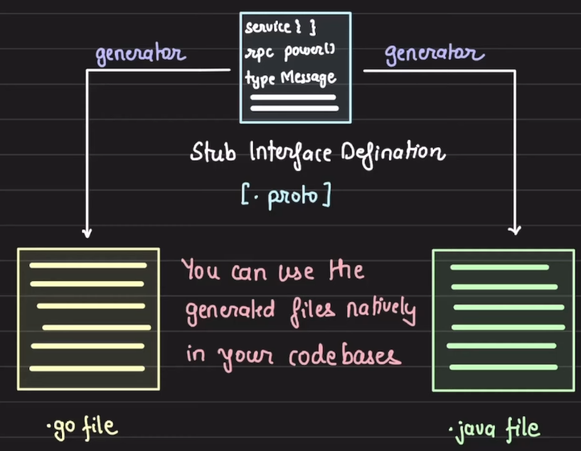

# Remote Procedural Calls

1. These are widely adapted to do inter service communcations.
2. These are designed to make a network call look like a local function call by abstracting out all the complexities like serialization, deserialization and transport

## Communication using REST

1. Suppose you have an authentication service and a notification service. Whenever user tries to login (handled by authentication service) , the notification service sends an email notification to the user
2. Suppose you code looks like this

   ```javascript
   function login(email, password) {
     // logic for verfifying email and password
     notification_otp(email);
   }
   ```

3. Here, in the `notification_otp(email)`, you have to write logic of making the fetch call to the notification service endpoint, say `notifcation-service.internal.abc.com`.
4. Here, we also have to handle the failures, retries etc and if there is another service who wants to communicate with notification service then it also has to implement the same thing
5. Also, if multiple services wants to communicate with notification service and they are written in multiple languages then we have to implement the same http request handling in different languages as all the languages have a diffrent ways of handling the http requests. Python has request library, Golang has net/http etc

## RPCs

1. RPCs abstract out all the repetitive tasks like deciding the communication protocol, retries, failures, marshaling and unmarshaling of data
2. If we use RPCs, requests to other services from a service looks like making a Routine function call
3. Using RPCs, we hide the complexity of a remote call
4. RPCs abstract out
   1. Marshalling and unmarshalling of data
   2. network packet movement

### Stubs

1. In an RPC request, stubs convert the methods, request types, response types into a form used by the RPC system
2. Every RPC implementation has its own interface language knowns as Stub Interface Definition Language. For example, gRPC uses `.proto` or protobuf format as the interface language.
3. Using the interface language, we define the types, functions etc our service contains  
   
4. In proto file, we only declare the types and methods. We dont write their actual implementation in it.
5. Steps
   1. We first write the interface definition in, say, proto file
   2. Then, we run a generator provided by the RPC. The generator will take the proto file and create a code that handles the network calls, marshalling and unmarshalling the data, and also the service methods, defined in the proto file. The generators can generate the code in the programming langauage of our choice given it is supported in it.
   3. The service functions, generated by the generator, does not contain the business logic which we have to write
   4. This generated code by the generator is known as stub
6. We have to share the same proto file with the client service which will follow the same procedure to generate the stub on its side as well in the language of its side

### Communication in RPC

1. RPC can use any layer 3 protocol say TCP or UDP
2. RPC can also use layer 7 (Applicaton layer) protocols like HTTP like gRPC uses HTTP/2

### Pros of RPC

1. Easy to use and strong api contract
2. remote calls feels like a local call
3. most RPC frameworks, like gRPC, supports most modern languages
4. most mundane tasks are abstracted
   1. failures
   2. retries
   3. payload conversion to language native objects
   4. network protocols and multiplexing
5. Performance out of the box like
   1. compression
   2. multiplexing
   3. efficient payload
   4. connection pool
   5. streaming

### Concerns with RPCs

1. Stubs need to be regenerated when signature changes
2. Testing RPC is non trivial
3. browser support is limited
