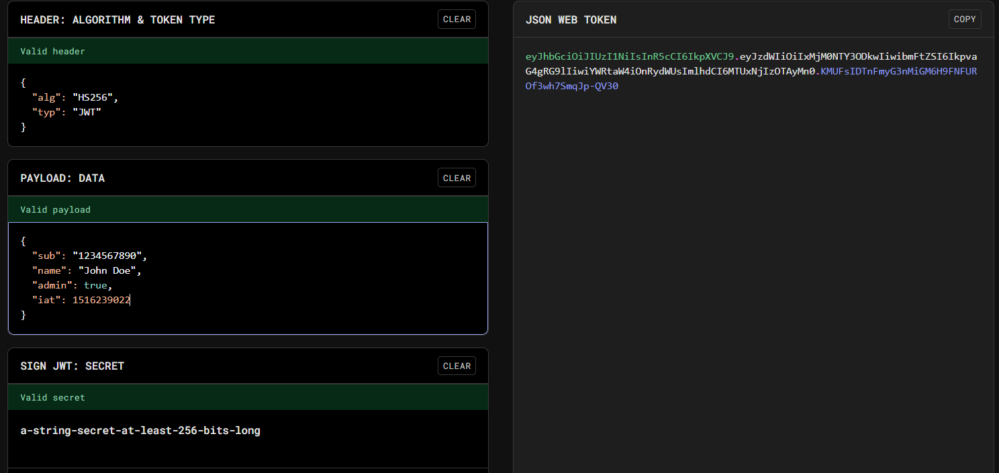
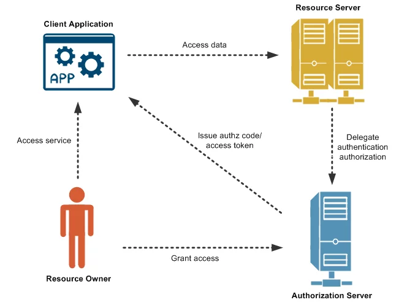

# Authentication and Authorization

1. Authentication answers the question, `who are you?` and Authorization answers the question, `What can you do?`

## Sessions, JWT and Cookies

1. HTTP is the backbone of client server communications. By default, HTTP is stateless means it treats every interaction as an isolated interaction
2. But there are some interactions like the user should remain logged in, in all the pages of the website, after logging in through the login page of the website. These marked the beginning of stateful interactions

### Sessions

1. Session make the request stateful. A session provides a way to establish temporary server side context for each user.
2. Steps:
   1. When a user login, the server creates a unique session id and stores it with the user info like user id in a persistent store like database or redis.
   2. The generated session id is sent to the client browser as a cookie
   3. All the further requests, that the client will make to the server, the client will include the cookie, with the session id, in the request
   4. Now, using the session id, the server will know the user id and through the user id, the server can fetch details like the things user has in its cart or it can fetch user data
   5. The sessions are short lived so if in some request, the user sends the expired session id, then server will either log out the user and ask him to login again or it will automitically create a new session id and sent it back to the client so the old session id gets replaced with new one
3. The session id enabled the web to have memory about the interactions

### JWT

1. As the web application grows into global distributed system, the stateful systems start causing bottleneck, because
   1. Memory
      1. Maintaining session data for millions of users become costly
   2. Replication
      1. in distributed architectures, synchronizing session data across servers or regions introduced latency and consistency challenges
2. JWTs offload state from the server while maintaining state, security and integrity
3. JWT is a stateless mechanism for transferring claims in a stateless manner between different two parties or systems
4. JWTs are self contained tokens. These tokens contain user data, like user id, role etc, and their cryptographic signatures in one token which is encoded.
5. JWT struct  
   
   1. The header specifies metadata about the JWT itself such as the signing algorithm for the JWT token
   2. Payload data is the data that the server stores in the JWT token like userid, user_role etc. The data is stored in JSON format
   3. Last part of JWT token is the signature which tells the server whether the token is tampered or not when the client sends the JWT token again in subsequent requests. The token is signed using a secret key which the server will keep on its side in some secrets manager. The secret key is used to encode or decode the token. If the JWT is tampered, then the server will not be able to decode it using the secret key
6. Thus, JWT can be used to verify users data in a stateless manner as the server does not have to store the session info any more.
7. After a user login, the server will generate a JWT token using the user data and encrypt it using the secret key and send it back to the client in a cookie. The clients browser will attach the JWT token cookie in subsequest requests and the server will decrypt the token and fetch the user info using the user id from the token
8. Advantages of JWT
   1. It saves a server side storage cost as server need not manage the state on its side
   2. Scalability as the request can go to any server in the distributed arch and the server will be able to decrypt the token using the secret key
   3. Portability as the JWT tokens can be passed between different systems
9. Challenges of JWT tokens
   1. Token Theft
      1. Since JWT was stateless if someone has access to your JWT, they can impersonate as you. There is no mechanism on server side to invalidate that token even if it is theft as the server is not maintaining the state and which ever request has a valid JWT token, the server will execute the request
      2. The only was is that the token expires or the server change its secret key. The changing of secret key will invalidate all the existing user JWT tokens which does not seem like a good idea.
   2. Revocation
      1. If the server wants to revoke some users access to the system, with JWT it is not possible as the server has to grant the permissions that are stored in JWT to the requesting client
10. Hybrid approcah can be used where the server maintains a JWT blacklist in a persistent storage. This can be used to block the user and their access but it makes the implementation somewhat stateful as server has to maintain this blacklist
11. Generally it is recommended to go with an auth provider, like Auth0, in production systems as it is there duty to maintain, invalidate tokens on their side

### Cookie

1. It is someway of storing a piece of info in user's browser from the server side
2. Using cookies, server stores some data/info in client's browser. This cookie feature is offered by browsers.
3. A cookie stored by a server/website will only be accessible to that server/website. No other website/server can access the cookies stored by other website.
4. Browsers also attach the cookies stored by a website while making subsquesnt requests to the website server by default
5. The server, after user login, sends the token or JWT token to be set in the client's browser in cookies and the browser will send the cookies set by the server in subsequent requests in request headers by default

## Types of Authentication

1. Stateful authentication
2. Stateless authentication
3. API key
4. OAuth2.0

### Stateful Authentication

1. Initially client sends email and password to the server. The server validates them and if they are correct, the server generates a session_id.
2. The server stores the session_id, user data like user_id and session expiry time in some persistent storage like any database or redis
3. The server also sends the session_id back to the client in response. The response will have `set-cookie` header which will set the session_id in the clients browser cookies. The cookie will be an HTTP only cookie that means JS cannot access the cookie, the browser will take care of it.
4. Now, all the subsequent requests that the client makes to the server, the browser will attach that session cookie in it.
5. The server will extract the session_id from the cookie and validates it along with its expiry time. If everything looks fine, the server will respond the clients request.
6. Pros:
   1. We have centralized control over all the sessions here. We will have info about all the active sessions of the users that we can extract from the persistent storage
   2. As we have the control, we can invalidate any session and revoke the user access any time because if a session_id's session is inactive, the user has to login back again to get the new session_id
   3. As this is a very secure method, most applications like Banking etc use the session based/stateful authentication as the in case of session id theft, that session_id can be invalidated anytime by the bank
7. Cons
   1. Limited scalability
   2. Higher operational complexity in case of distributed systems
   3. Latency issues

### Stateless Authentication

1. Initially client sends email and password to the server. The server validates them and if they are correct, the server generates a signed JWT token. The server will have a secret key which will help us in signing and verifying the JWTs
2. The JWT token will have the user's information, like user_id, token issue timestamp, user permissions etc, stored in it. The information is encrypted using the secret key
3. The JWT will be sent back to the client in the response. The server will not maintain the JWT info on its side. The token can be send in header but that's optional
4. The client need to send the JWT back in subsequent requests. Generally the tokens are sent under the `Authorization:<JWT>` header in requests
5. The server extracts the JWT token, decrypts it using the secret key and if it gets decrypted successfully then the server will extract the user info like user_id from the token itself.
6. Pros
   1. Can be easily used in distributed systems
   2. Ideal for mobile friendly applications where cookies are not present
7. Cons
   1. Token revocation is not possible so the token will remain active until it gets expired. Thus in case of token theft, nothing can be done
8. Thus, webapps can use stateful and mobile applications can use stateless authentication

### API key based authentication

1. You go a 3rd party platform like contentful CMS and generates API keys for your account
2. The API key can be used to gain access to the platform's backend server. The platform's backend server will expose some apis which our application can use to make changes or add data or retrieve data from the platform programatically by sending the generated api keys in request headers for validation/authentication
3. For example, we can use the api keys generated in contentful CMS to add blogs or retrieve some blog information
4. This is used when your server wants to communicate with a 3rd party server in permission based manner. Basically, these are important for machine to machine interaction

### OAuth 2.0 (OpenId Connect)

1. Suppose we visit multiple websites like Gmail, Netflix, Steam etc we have to login/create account in all the websites with different credentials
2. This approach has some issues:
   1. Security risk, reusing passwords is very common and incase of password theft, a lot of accounts can be compromised
   2. Fatigue, as users have to manage a lot of accounts and their passwords
3. This gave rise to a very important concept in OAuth i.e. Delegation.
4. One website started needing access to other websites for example, reminder application on your phone may need access to your gmail to scan and keep record of different events like holidays, flight bookings, movie bookings etc to remind you about the event on time, similary, a social media app like instagram, twitter etc wants to import your contacts from native contacts app or google contacts. These accesses are needed programmatically by the applications
5. Inorder for one application to get access to another platform, intially platforms started sharing the user passwords amound themselves which lead to issues like the other application will get full access of user's account and also there is no way to limit the access of resources. The user needs to change the password so that the other application's access can be revoked from an application. This problem is known as Delegation problem
6. OAuth
   1. Tokens are used here which provide limited access of one platform to the other like we can give access a readonly google contacts permission to another application. The application will only be able to read the google contacts and will not be able to perform any other operation in your google account
   2. Diagram:  
      
      1. The different components are Client, Resource owner, Resource server and Auth server
      2. Resource owner is the user who owns the data i.e. you.
      3. Client is the application that is requesting access of your resource for example, Instagram is requesting access to your google contacts. Instagram is the client here
      4. Resource server is the server where your resources are stored for example Google server having your google account info
      5. Authorization server is the server that issues the token after authenticating the user
