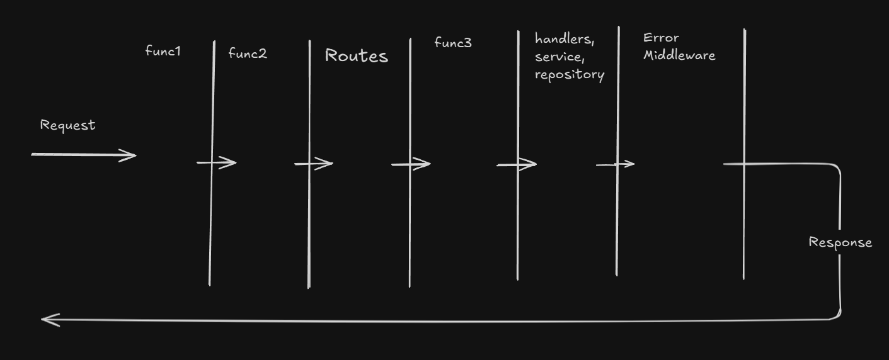

# Handlers, Services and Repositories

1. Your code must be running and listening at some port of a server. When request reaches the nginx proxy, it will be forwarded to the server at the listening port.
2. In the server, the request first reaches our routing algorithm. Each route is mapped to a particular handler. The handler is just a function that handles the request of a particular API
3. Handlers (a.k.a Controllers)
   1. In each handler or controller, we receive 2 objects, request and response. Handlers extract the request related stuff like request body, query params, headers etc from the request object. Handler send the response, say response body, status codes, headers etc. using the response object.
   2. The programming language automatically adds these objects, request and response, to the handler
   3. Handlers handle all the HTTP related stuff like getting the request, sending response with proper status code etc
   4. Responsibilities
      1. Take out the necessary data from the request object like query params, body etc
      2. De-serialize/Unmarshal the JSON object that we received in the request body into a native data format like in JS, JSON can be directly used as object because JSON is a form of JS object, in Golang we need to convert the JSON to a struct, in python we need to unmarshal JSON into dictionary. This process is generally called as Binding. If we are not able to de-serialize the request body then we send 400 (Bad Request) response code to user
      3. Validation and Trasnformation of the request body is also needed since not every language has a native support for JSON except Javascript. So there might be chances of data misinterpretation in case of unmarshalling into native data structure. At this step we can also set default values for some data properties if they are not present in request body
      4. After all the above steps, we will have a solid data format for further processing, now the controller layer calls the Service layer with all the neccessary data, parameters that the service layer will need to process the data
      5. After services layers processes the data, it will return the final result back to the controller/handler and handler will return the data in proper respone format back to the client
4. Service Layer
   1. Service layer should not deal with any HTTP related stuff
   2. The service layer has different functions which accepts some data paramaters and also contains some logic to process the data and give the desired result.
   3. The service layer methods can also call the repository methods that will perform the database opertaions needed for the processing of the data received by Service layer
   4. Service layer can also call multiple repository functions to form the desired result and return it to the handler
   5. Service layers is the main layer where actual processing of the request data happens
5. Repository layer
   1. The repository layers functions takes some parameters necessary to form the desired database query and perform database operations using those parameters by running those queries
   2. Repository layer only deals with performing CRUD operation on the DB i.e handling the database calls

# Middlewares

1. These are functions that can be placed at different steps between getting the request till sending the response. The functions can perform different task that are necessary to be performed on all the requests
2. We can have middleware functions before the routing, request processing and response sending layer  
   
3. Most common usecases of middlewares:
   1. Deserialization of data
      1. Suppose you are using JS and request comes to your server, first of all you want to deserialize the request body to know if the format of data sent is correct or not
      2. If you want, you can put this logic in handler as well but you have to put the same code in all the handlers which gives rise to code duplication
      3. So we create an middleware for deserializing and put it before the handler layer and after the routing so it will first deserialize the data and then forwards the request to handler
   2. Authentication
      1. We need to verify whether the JWT token or session id sent in the request is valid or not
      2. We can create a middleware just before the routing to check at the very first itself whether the user is authenticated or not
   3. Error handling
      1. At the very end we can have a error handling middleware. It will be executed if something breaks in any middleware itself.
      2. This middleware will return a proper error message and status code to the client in case of the request fails at the middleware layer
      3. If we have multiple middlewares along with an error middleware and request broke at any middleware then execution of all the other middlewares will be skipped and the control will go to the error handling middleware
4. Middleware functions, by default, gets the following arguments:
   1. err
      1. This is useful for receiving error message from another middleware, in case of failure, by the error handling middleware
   2. req
      1. This is the same request object that any handler gets
   3. res
      1. This is the response object that any handler gets
   4. next
      1. This is used to pass the control to the next execution stage after the current middleware is done with its job
      2. The next execution stage can be a middleware or routing or handler layer
5. All middlewares can be optional depending on the type of request
6. Since middleware also get the res param, so they can also send response back to the client without even processing the request by any handler
7. Middlewares saves us from code duplication and their order can be changed easily depending on the usecase
8. For all the requests, we might need to perform some common operations on each request. If we keep the code in a handler layer, then we need to add the same code in each handler which leads to code duplication. Thus we can keep the code in a middleware and it will automatically be run for each request
9. Order of execution of middleware is important as every middleware with next func will pass the request to the next middleware/route/handler
10. Use of middlewares
    1. Security
       1. We have middlewares for CORS, security headers, authentication, rate limiter
       2. All these middlewares can be put before the routing layer
       3. CORS is generally the first middleware
    2. Logging and Monitoring all requests
    3. Global error handling
       1. This is for handling the errors occuring in middlewares
       2. This will be the last middleware in our middleware ordering
    4. Compression
       1. Unzipping the gzip request data
    5. Data parsing
       1. Serialization and deserialization

# Request Context

1. It is some kind of state/storage that is scoped for a particular request
2. After the authentication token verification in the middleware, we create some request context containing the user data, a unique hashed request id etc. and attach it to the request object so that it can be used to track the request in all the further stages of middlewares, handlers, services and repos
3. This helps is logging and tracking a request throughtout its processing journey
4. This request context is a part of the request object and it contains info like userdata, request id, user permissions etc. as key value pairs. Userdata is fed to the context after the authentication middleware decrypts the JWT token successfully as JWT contains some userdata in it. We can generate a long hashed request id as well at this stage so we have something to track the request in logs. Or we can have a separate middleware which generates a unique request if for thr request to be tracked
