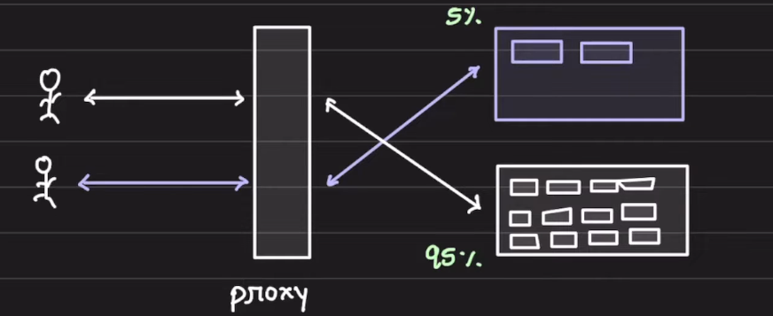
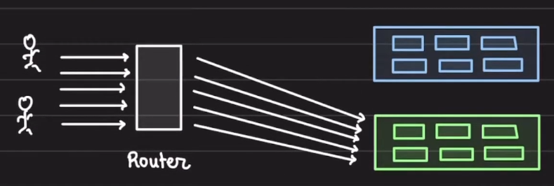

# Deployment Startegies

## Canary Deployment

1. Canary deployment is a pattern that allows us to rollout code, features, changes to an initial users before we take it to 100% of the users
2. Suppose you have 7 servers in production and you have some new changes to be deployed. Instead of deploying the changes to all the 7 servers, you deploy it to 1 server. Some requests, say 5% of total requests, will be routed to the new code server and rest will be routed the other 6 servers. The monitoring of the new changes in production server should be done to make sure that the new changes can be released to all the servers and 100 % of the users
3. The flow will be :
   1. Deploy the new code to one server
   2. Monitor the vitals: RAM, CPU, Error rates
   3. Test the changes explicitly on the canary server
   4. If all good, rollout to the remaining servers
   5. If not, rollback or route the 100 % traffic to the old servers
4. How canary deployments are implemented?
   1. We create a small parallel infra and put a proxy or load balancer or api gateway at the front.  
      
   2. The new code will be deployed to the new infra
   3. The proxy will route some of the traffic to the new infra and rest to the old infra
5. Pros of canary deployments
   1. It allows us to test the changes in production with real users
   2. Rollbacks are must faster
      1. As the new version of code is deployed on few machines, rolling back the changes will require us to only rollback those few machines and rerouting the traffic to old machines
   3. Limited blast radius
      1. If the new version of code has bugs, with canary deployment it will only affect very limited requests
   4. Zero downtime deployments
      1. As we gain more confidence, we can increase the rollout to more users.
      2. It means here, we have incremental rollout i.e. 1%, 5%, 10%, 20%, 50%, 100%, of the traffic to new code
   5. We can deploy even when we are unsure about the new release
   6. We can use canary deployment in A/B testing
      1. A/B testing is a method to compare two versions (A and B) of something—like a webpage or app feature—to see which performs better. Users are split into groups, each seeing one version, and results are measured (e.g., clicks or conversions) to decide which version works best.
6. Selection of users and servers can be more sophisticated
   1. Geographical
   2. User cohorts
   3. Random selection
   4. Beta users
   5. Sticky + random selection
   6. Internal employees
7. Cons of Canary deployments
   1. Engineers will habituated to test in production
   2. Architecting a canary deployment is complex
      1. We need extra components like LB, API gateway, separate scaling policy, instance/container launch config
   3. Parallel monitoring setup
      1. Observability is super important in canary setup so having a separate monitoring setup for both new and old version is mandatory to check the vitals like CPU, RAM etc

## Blue Green Deployments

1. Blue Green deployment is a deployment pattern that reduces the application downtime by running 2 identical production environmenrts called Blue and Green
2. At one time, only one of the environments is live and serving the traffic. The green one will be live and blue one will be idle  
   
3. Whenever we have a new release, we will up new infra identical to the production env and deploy the latest changes in it. Then we monitor the new infra if the mertics are fine after the deployment of new code. At this time, the new infra will be the Blue infra and current production setup, running the old code, will be the Green Infra. Now, once the testing is done for the new infra, we will make a switch in the reverse proxy or LB or Api gateway, to route the whole traffic to the new infra with latest code. Now, at this time, the old infra will become the Blue infra and new infra will become the Green infra
4. This ensures almist negligible or Zero downtime
5. In general setup, when we have to deploy new changes in production, we need to restart the api server. At the time of the api server restart, the inflight requests are hampered and the server does become unresponsive. The api server restart is not a huge down time but still there is some micro downtime which will result in some 5xx errors
6. Three key advantages:
   1. Simple rollout
   2. Quick rollback
   3. Easy disaster recovery
7. How blue green deployments are implemented?
   1. First, we need to ensure the changes are forward and backward compatible both code changes and database changes
   2. Create a new parallel setup similar to the production setup
   3. Deploy the changes into the new setup
   4. Validate the correctness of the new setup - QA, Sanity, vitals
   5. Configure the proxy to switch 100% traffic to the new setup
   6. Monitor again the new setup and if everything looks fine for sometime, remove/stop the Old infra
8. Pros of Blue Green Deployments
   1. Rollbacks are superfast and simple
      1. As we have to config the proxy to route the traffic to the older infra incase of any failure in the new infra
   2. Downtime during the deployments is minimised
   3. Deployments are quick
   4. Disaster recovery is simple
   5. Deployments can happen in working hours/ busy hours as well as we are creating a separate setup and if everything looks fine then we are routing the traffic to it
   6. We can also debug why a release failed
9. Challenges with BG deployments
   1. During deployments the infra cost would be 2x
   2. Stateful applications would take a hit
      1. It means if the application is using local storage of the server to save some info but as the requests are routed to new server then the saved info might get lost
   3. Database migrations
      1. In BG deployments, the DB is not copied. Hence we need to ensure forward and backward compatibility in schema alterations
      2. It means suppose new code changes need some alterations in DB schema which is not compatible with the old code which is currently running in production. If, in case of any issue in the new code, we have to rollback from the new code to the old code setup and as the DB changes are not compatible with the old code version, this will lead to catastrophic failures in old code as well
   4. Forward and backward compatibility of API changes
   5. Handling shared services across blue green deployment
10. When to use BG dep
    1. No downtime deployment is priority
    2. We can tolerate a 100% switch of traffic from older version code to newer one
    3. We can bear the cost of running 2x infra
11. Points to remember
    1. Having a solid automation test suite that will help us in testing the sanity checks and new changes in the new release
    2. Ensure backward and forward compatibility
    3. Before switch validate the new setup
    4. Infra cost will shoot up, minimize the time for which both infra, blue and green, are up
