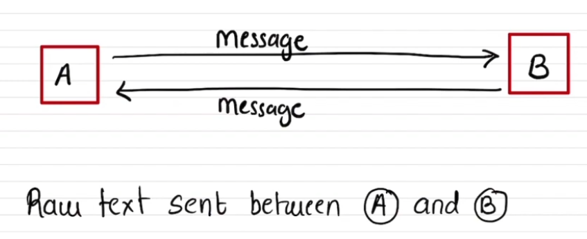
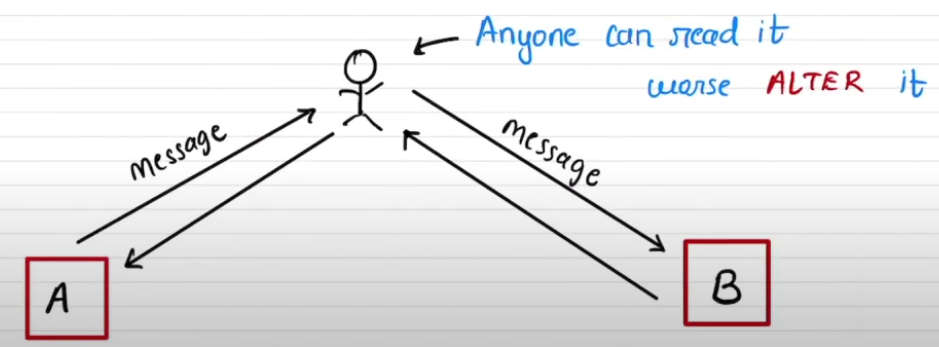
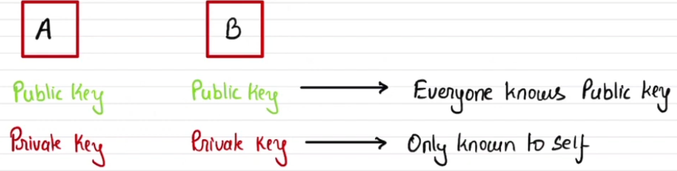
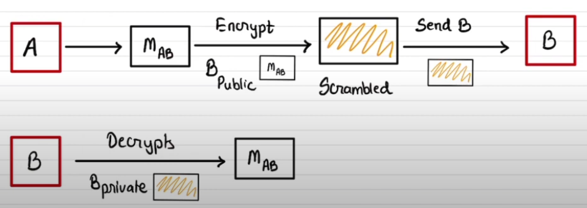
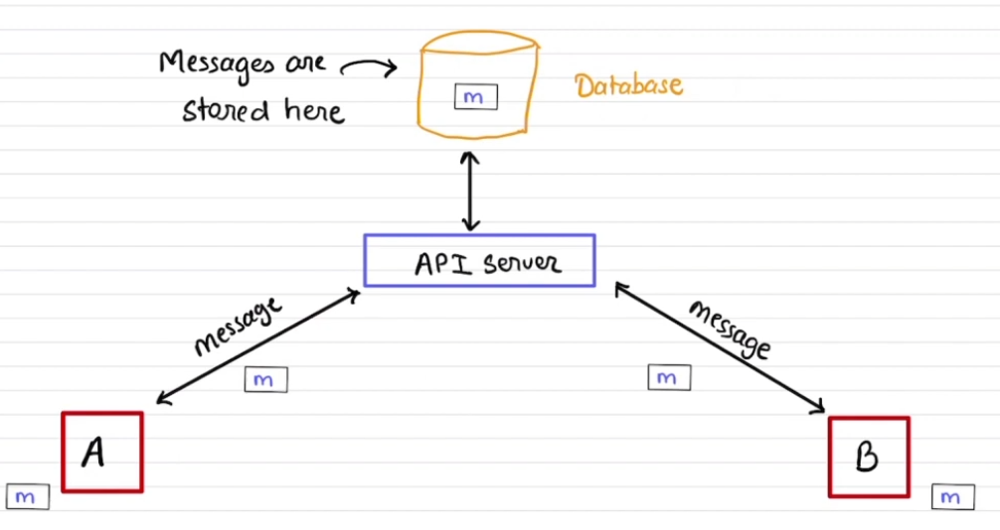
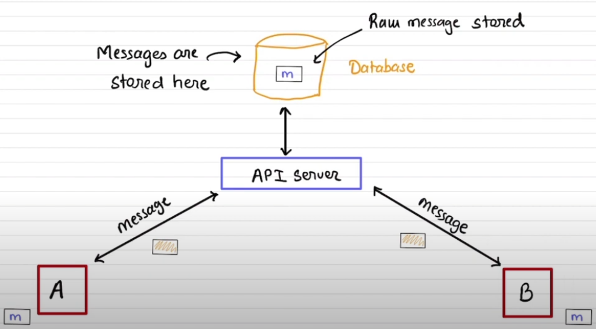
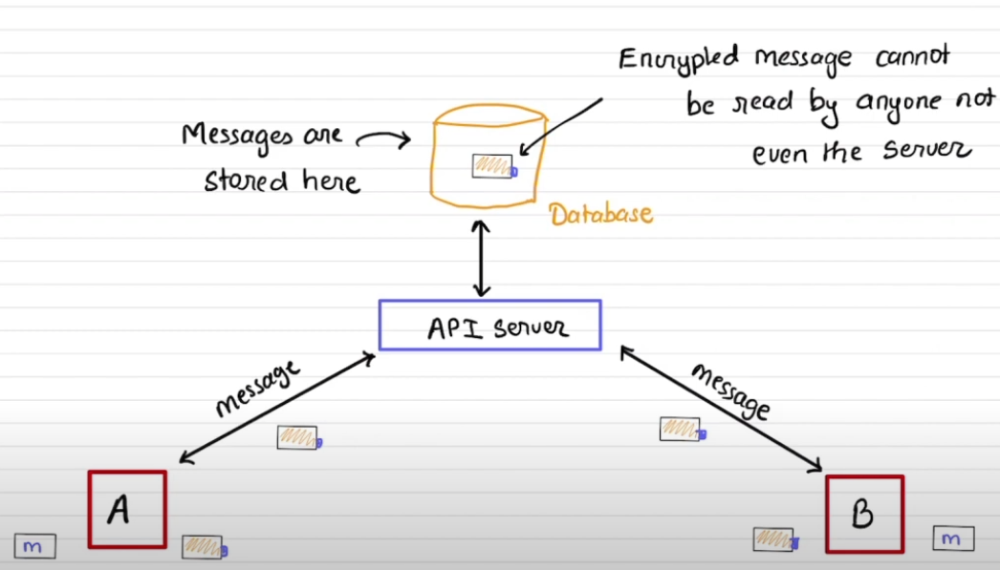

# End to End Encryption

1. Messaging apps like WhatsApp, Signal etc use this end to end encryption to ensure message sent by `A` person to `B` person, will only be read by `B` person. No one else, even the messaging app server will be able to read the message
2. Suppose we have a non encrypted channel through which two people say `A` and `B` shares message. The channel is prone to man in the middle attack means anyone can read the messages shared between `A` and `B`  
   
3. The thrid party can also alter the message  
   
4. End to end encryption can be achieved by using `Public key Cryptography`

## Public key cryptography

1. Message encrypted with a public key can only be decrypted with its private key. Also, message encrypted by a private key can be verified by a public key
2. Lets say we have 2 parties `A` and `B`. Both of them will have their own public and private keys. Lets name them as `Pub_A`, `Pri_A`, `Pub_B` and `Pri_B`
3. The public keys are publically accesible to everyone and the private key stays locally secure in the mobiles of `A` and `B`. The private keys are not even uploaded to the whatsapp server  
   
4. The A will have B's public key and B will have A's public key. If A wants to send a message to B, first A will encrypt the message with B's public key and sends the message. The message will reach the whatsapp server and stored in the DB as an encrypted one. After that the message will be delivered to B where B will decrypt the message using its private key  
   
5. Now, since the public key of both the parties are publically accessible, how B ensures that the message is really sent by A?
   1. Using `Digital Signatures`
6. Adding Digital Signatures to the message:
   1. A encrypts the message with B's public key
   2. A will also create a digital signature using the encrypted message and its own private key i.e `Pri_A`. Basically, A will take a part of the encrypted message and encrypts it again with its own private key
   3. A will then send the message to B.
   4. B, on receiving the message, first verifies the message's digital signature using A's public key. If the signatures are verified then B will decrypt the message using B's private key
   5. Note, since B only has A's public key, B cannot decrypt the digital signatures send along with message. B will only be able to verify if that the digital signatures are from A

### 3 scenarios

1. No encryption and messages are shared over HTTP (insecure channel)
   1. The message are not encrypted here and are also stored in DB as raw messages.
   2. Here, any one can see the actual message by breaching the channel and also any one in the company can see the messages by looking into the DB  
      
2. No encryption but the message shared over HTTPs
   1. The message are shared over https after encryption. So no body will be able to see the message in transit
   2. The messages will be decrypted at the load balancer or nginx level and then stored in DB as raw text and then they are again encrypted to be transfered from server to the end party
   3. Only transport level security is provided in this setup
   4. Here, the actual messages cannot be seen at the transit level but any one at the org level can see the message from the DB  
      
3. End to end encryption with transit over HTTPs
   1. A encrypts the message with B's public key and sends the message along with digital signatures
   2. The message is saved in DB as encrypted one
   3. The B will receive the message and verifies the A's signature and then decrypts the messasge using its private key
   4. No one, except A and B, will know whats there in the message  
      

### How user's will get each others public key?

1. After adding the contact of other person in your phone, the public key of the parties will be shared along with the meta data. The public keys of user can also be shared on api server DB and can be send again in case of device change by one user
2. The private keys are not shared
