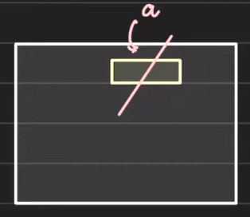

# Garbage Collection (GC)

## Memory Management

1. Every program needs memory to allocate variables and objects and access them to do the job
2. The two possible places where the variables are allocated:
   1. Stack
   2. Heap
3. Stack:
   1. It is automatically garbage collected
   2. Whenever a function is being executed, it is pushed to the stack in the memory. All the statically declared variables, in the function definition, gets some memory allocated in the stack frame of the function. Generally non pointer objects are stored in stack. The vairable holding the reference of the object are stored in stack trace but the actual value of the oject is stored in heap.
   3. When the function returns, after execution, its stack trace is removed from the memory stack and all the variables that are allocated memory inside it are garbage collected.
   4. Also, stack traces hold variables that are not very large in size. If you want to allocate memory to a very large object, stack might throw an error.
4. Heap
   1. Garbage collection is much needed here both explicit and implicit
   2. Everything which is non stack and part of RAM is heap storage
   3. In heap, you can request your coding language's runtime engine to allocate some memory for your objects dynamically. The address of the allocated memory is returned
      ```
        int *books = malloc( 10 * sizeOf(book) )
      ```
   4. Allocating objects in heap memory also allows us to pass the object references to other functions as well. This saves a lot of memory which would have been allocated and deallocated in case of passing the actual value to the other functions, means in call by value
   5. Need for heap:
      1. Heap can hold objects that are too big and too inefficient to be on stack
      2. Heap can hold dynamically growing objects like Arrays, LinkedList and Trees
   6. Objects allocated in heap are always addressed by Reference (Pointer). The pointer variable holding the address of the object is stored in stack trace of the function but the actual value of the object is stored in heap memory

## Garbage Collection: Explicit Deallocation

1. Programming languages provide support for deallocating the allocated object on the heap explicitly like in C++, we have `free()` and `delete()`.
2. For example, the `free(a)` will free the memory referenced by `a` pointer variable  
   
3. We can't rely only on explicit deallocation to free up the memory space due to human error that would result in non presence or not executing the memory deallocation function

### Explicit deallocation failure

1. If due to some reason, the explicit deallocation code is not executed in the program, this would have some consequences:
   1. Memory Leak
   2. Dangling Pointer
2. Memory Leak:
   1. It happens when we are allocating memory and not deallocating it
   2. After sometime, the memory of the server where the program is running will run out of memory and new execution will not be able to allocate memory.
   3. If the process is unable to allocate memory then it will crash
3. Dangling Pointer
   1. This happens when an object is freed but it is being still refernces
   2. Suppose there are 2 threads,say T1 and T2, running parallely and some code in both the threads is referencing the same object in the heap memory. Now, suppose one thread's, T1, code is done and it freed the object's memory and some other process in the computer allocates the same memory, where the object is present, to some other object. Now, if the other thread, T2, tries to reference the object it was previously referencing, it might get a garbage or different value.
   3. The program might receive garbage value or it might crash. The behaviour is unpreductable in case of dangling pointers
4. Thus because of the above reasons, the runtime engines of the programming languages provide an way to do Automatic garbage collection as these are more reliable, reduces humar effort and errors
