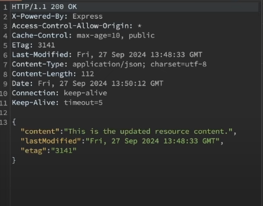
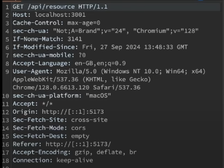
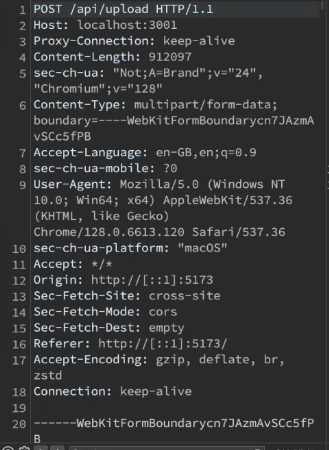
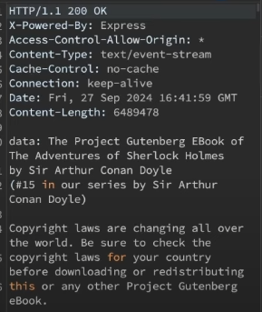

# HTTP

## Introduction

1. It is a protocol through which our browsers(Client) communicates with our servers either to send or receive data
2. 2 ideas which are at the core of HTTP:
   1. Stateless
      1. It means http has no memory of past interactions
      2. Each http request carries all the necessary information for the server to process it.
      3. Thus, each request should contain all the necessary data like authentication tokens, session info.
      4. Advantages:
         1. This stateless arch. simplifies server arch. as the server does not need to store or maintain session info.
         2. Statelessness makes it easy to distribute requests across multiple servers thus helping in balancing the load.
      5. Because http is stateless, developers often implement state management techniques like cookies or sessions or token to maintain continuity in interactions when needed.
   2. Client server model
      1. In http request response flow, there is a client and server always
      2. The client can be browser or an application. It is responsible for providing all the necessary info that the server needs to identify and process the request
      3. The server waits for a request and then processes it and then reverts with a response
      4. HTTP states that the communication is always initiated by the client
      5. To send request, the client and server first need to establish some kind of connection. HTTP uses TCP connections.
3. HTTP versions:
   1. We have the following HTTP versions:
      1. HTTP/0.9
      2. HTTP/1.0
         1. Here, each request opened a new connection with the server which lead to inefficiencies. Also, connection has to be openend and closed for every request and response
      3. HTTP/1.1
         1. Persistent connections are introduced here allowing multiple request and responses over the same tcp connection
      4. HTTP/2.0
         1. Here, multiplexing is introduced which allowed multiple requests and responses over a single connection
      5. HTTP/3.0
         1. It is designed over UPD and not TCP which improved performance with faster connection establishment
4. HTTP request message
   1. Example of a request msg
      
   2. In the above message, we first have HTTP method, `PUT`. Then we have the resource url, `/api/users/12345`. Then we have the http version, `HTTP/1.1`
   3. Then we have headers
   4. Then, there will be a blank line to signify that all the headers are over
   5. Then, we have request body in JSON format
5. HTTP response message
   1. Example of response message
      
   2. First, we have the http version, `HTTP/1.1`, then we have the status code, `200`, then we have the value of the status code, `OK`.
   3. Then, we have some resposne headers
   4. Then, there will be a blank line to signify that all the headers are over
   5. Then, we have the response body in JSON format

### Headers

1. Headers are basically key value pairs
2. Why dont we send the headers info in body? Why we need a separate layer for headers?
   1. In headers, we send some important info that will be used by the server to identify of the request is valid or not. If we send the header info in body, then the servers first need to parse the body and process it to know if the request is valid or not. This will waste a lot of server resources in case of a invalid request.
3. Categories of headers:
   1. Request headers:
      1. Eg:
         1. user-agent:
            1. Tells the type of client like browser, postman, app etc
         2. Authorization
            1. Used to send bearer tokens
         3. cookie
         4. accept
            1. It tells what kind of content we are expecting
      2. These are sent by the client to the server to provide some info about the request
      3. It helps server understand the clients env, its preferences.
   2. General headers
      1. These are used in both Request and Response
      2. These have some metadata about the message itself.
      3. Eg:
         1. date
         2. cache-control
            1. It contains values like no cache or max age of the cache
         3. connection
            1. It tells weather to keep the connection live or not
   3. Representation headers
      1. It primarily deal with the representation of the resource being transmitted
      2. Eg:
         1. Content-type
            1. The format of the request body sent like JSON, XML
         2. Content-length
            1. It describes the size of the resource
         3. Content-encoding
            1. It specifies any encoding like gzip etc applied on the body
         4. ETag
            1. It is a unique identifier mostly used for caching
      3. These headers ensure the client and server know how to interpret the response and request respectively.
   4. Security headers
      1. It enhances the security of the request and response by controlling behaviours like content loading, cookies and encryption
      2. Eg:
         1. Strict-Transport-Security (HSTS)
            1. It ensures that the client only communicates over https preventing protocol downgrade attack
         2. Content-Security-Policy (CSP)
            1. It restricts the sources from which the content like Javascript, CSS, images can be loaded preventing cross site scripting attacks
         3. X-Frame-Options
            1. Prevents the webpage from being embedded in iFrame preventing click jacking attacks
         4. X-Content-Type-Options
            1. Ensures that the browser does not try to guess the mime/type of the content
         5. set-cookie
            1. It secures cookies by making them inaccessible to JS and ensuring they are sent over HTTPS
      3. Security headers helps protect the client and server by controlling how the browser behaves with resources and enforcing security policies
4. Http headers have the following 2 ideas
   1. Extensibility
      1. Http is highly extensible because headers can be easily added or customized without altering the underlying protocol
      2. Custom headers can be added for own specific usecases by the devs
   2. Remote control
      1. HTTP headers act as kind of remote control on the server side
      2. They allow the client to send instructions or preferences to the server, influencing how the server responds or process the request
      3. For example: client specifying the type of content it is expecting from the server in `accept` header.

### HTTP Methods

1. These are actions that client can request on a server
2. Methods define the intent of the interaction
3. Methods:
   1. GET:
      1. To get some kind of data from the server
   2. POST
      1. To create some new record
   3. PUT
      1. To update an existing record data by completely replacing it with new data
   4. PATCH
      1. Update some record in place
   5. DELETE
      1. Used to delete records
   6. OPTIONS
      1. This is used in the CORS flow
      2. This method is used to fetch the capabbilities of the server for a cross origin request which is used because browsers have same origin policy
4. We have idea of idempotent and non idempotent in http methods
   1. Idempotent means no matter how many times the api is called the result will always be tthe same
      1. GET, PUT, DELETE are idempotent
   2. Non Idempotent
      1. POST

## CORS

1. By default, browsers have same origin policy. This means browsers restrict webpages from making request to a domain different from the one serving the webpage.
2. For eg: if you visting same abc.com and there is a webpage served to you. Now, by default, the webpage cannot make call to anyother domain like xyz.com or api.abc.com due to CORS issue. It can only make call to any api hosted on abc.com only.
3. CORS is a security mechanism enforced by browsers to control how web applications interact with resources hosted on different domain
4. Without CORS, browsers block the request made from a web application running on one origin like example.com to a different origin like api.example.com for security.
5. CORS allows servers to specify who can access their resources and how.
6. Flows in Cross Origin requests:
   1. Simple request
   2. Pre-flighted request

### Simple Request

1. Lets say our frontend is at example.com and our server is at domain api.example.com.
2. We made a get request which would look like this:
   ```
    // request
    GET /api/products/123 HTTP/1.1
    Host: api.example.com
    Origin: https://example.com
    Accept: application/json
   ```
3. The browser automatically adds the origin header to indicate the origin of the request
4. Now, once the request reached the server, the server will check for the origin against its CORS policy. If the origin is allowed, the server will include the Access-Control-Allow-Origin header in the response with the requested data

   ```
    HTTP/1.1 200 OK
    Content-Type: application/json
    Access-Control-Allow-Origin: https://example.com

    {
        "product": {
            "id": 123,
            "name": "Example Product"
        }
    }

   ```

5. After server sends the response, the browser looks for `Access-Control-Allow-Origin` header in the response. As the Host domain and Origin are different in the request, the browser check whether the response header has this `Access-Control-Allow-Origin` header or not.
6. If the `Access-Control-Allow-Origin` is present and its value is either same as the request `Origin` or `*` (means all origins are allowed), then the browser will pass on the response to the client
7. If the response, look like:

   ```
    HTTP/1.1 200 OK
    Content-Type: application/json

    {
        "product": {
            "id": 123,
            "name": "Example Product"
        }
    }

   ```

   It means the server didnot add the `Access-Control-Allow-Origin` CORS header or the particular request origin is not allowed, then the browser will block the response to reach the client for parsing and `CORS error` will be thrown

### Pre-Flighted request

1. Conditions based on which browser decides if it is a simple request flow or preflighted flow. If anyone of the following conditions becomes true, the request will be considered as preflighted request:-
   1. The method is not GET, POST or HEAD
   2. The request includes non-simple headers like Authorization, X-Custom-Header etc
   3. The request has a content-type other than `application/x-www-form-urlencoded`, `multipart/form-data` or `text-plain`
2. One condition is must that the request should be a cross origin request and if anyone of the above conditions is true, then the browser will consider the request as Pre-Flighted request.
3. A preflight request is made with an `OPTIONS` method
4. A preflight request looks something like:
   ```
    OPTIONS /api/resource HTTP/1.1
    Host: api.example.com
    Origin: https://example.com
    Access-Control-Request-Method: PUT
    Access-Control-Request-Headers: Authorizartion
   ```
   1. The preflighted request has the request method as OPTIONS followed by resource url and Http version
   2. Here above, Access-Control-Request-Method is asking the server if `PUT` method is available, for the `/api/resource` route, or not
   3. Access-Control-Request-Headers ask if the `Authorization` header is supported in server or not
5. Before the actual request from client, the browser will send the preflighted request or OPTIONS request to the server (at api.example.com). This request does not include the actual data. It is a general enquiry to the server about its capabilities.
6. If the server is properly handling the CORS flow and supports the cross origin requests, it will respond something like:
   ```
    HTTP/1.1 204 No Content
    Access-Control-Allow-Origin: https://example.com
    Access-Control-Allow-Methods: PUT, DELETE
    Access-Control-Allow-Headers: Authorization
    Access-Control-Max-Age: 86400
   ```
   1. 204 status code is returned which signifies no body in the response
   2. `Access-Control-Allow-Origin` specifies the origin supported by the server as a valid cross origin request maker. It can also have value `*` which means all types of origins are allowed
   3. `Access-Control-Allow-Methods` specifies the methods allowed for `/api/resource` route
   4. `Access-Control-Allow-Headers` specifies the headers allowed for requests
   5. `Access-Control-Max-Age` asks the browsers to not to make any preflight request to te server regarding the `/api/route` route for the next 86400 seconds or 24 hours as there will be no change in the server regarding the CORS config for /api/route
7. If the CORS are not supported on the server side, it will send no response and the browser will simple throw the CORS error
8. After the preflight request is successful and verified, the browser will forward the original `PUT /api/resource` request that the client was sending to the server and the server responds according to the original request

## HTTP Response codes

1. HTTP response codes exist to communicate the status/result of a request in a standardized way.
2. The code quickly tells the client whether the request was successful, or resulted in error or requires further action.
3. HTTP response codes are standardised across all web services enabling consistency in how servers communicate with different clients regardless of the platform or code language

### Response Codes:

1. 1xx
   1. These are informational responses
   2. These are sent by the server to indicate that it has received the headers and the client can proceed to send the request body
   3. These are commonly used in large uploads where client first sends the headers to the server and if the server is Ok with the headers then the client can continue sending the rest of the body
   4. This is also used for indicating protocol switch for eg: upgarding from http to websocket whenever client asked for the upgrade
2. 2xx
   1. These are success responses
   2. 200
      1. It indicates that the request was successful and the server is returning the requested resource after performing the requested action
   3. 201
      1. It indicates that the request is fulfilled and resulted in creation of a new resource.
      2. For eg, POST requests or new form submissions
   4. 204
      1. It is used when there is no response body and the necessary information is shared by headers only.
      2. Commonly used in DELETE requests
3. 3xx
   1. There are redirection responses
   2. 301
      1. This means moved permanently
      2. It means the requested resource is permanently moved to a new Url and the future requests should use this new url.
      3. In the handler for the old route, we set the resposne status as 301 and redirect the request to the new route
   3. 302
      1. This means temporary redirect
      2. The requested resource is temporarily moved to a new URL but the client should continue sending the request to the old url
   4. 304
      1. This states `not modified`
      2. This tells that the resource has not been modified since the last time client requested it.
      3. This is mostly used in conjuntion with conditional get request to allow efficient caching. The client will ask the server if the requested resource is modified or not since last time it was requested. If the server responds with 304, the client can used the cached resource value
      4. This uses ETags
4. 4xx
   1. These are client errors
   2. 400
      1. This means bad request
      2. When the client sends data different from what is expected in that case this status code is used.
   3. 401
      1. This means unauthorized
      2. This is send when the client has failed to provide the valid credentials or is not authenticated at all
   4. 403
      1. This says Forbidden access
      2. This means the server understood the request but it refuses to authorize. This happens even when the client is authenticated but not authorized to access the record
   5. 404
      1. This is Not Found
      2. It is returned when client as asked for a resource which is unavailable or does not exist
   6. 405
      1. This says Method not allowed
      2. It is triggered when an invalid http method is used for a route
   7. 409
      1. This says resource already exists
      2. This is send when you are trying to create a specific resource bu it already exists in the system
   8. 429
      1. It says Too many requests
      2. This is send when we are trying to rate limit the too many clients requests in a particular interval
5. 5xx
   1. These are server errors
   2. 500
      1. It says Internal Server Error
      2. If something is broke or unexpected happen in the server then we send this code
   3. 501
      1. It says Not implemented
      2. When the server does not support the requested functionality but plans to add in the future, this code is sent
   4. 502
      1. This means Bad gateway
      2. This is usually seen in proxies like Nginx.
      3. It means when a server acts as a proxy in a load balanced system and the application server sends an invalid response
      4. This is not send intentionally by the application server. This is mostly handled by the proxy and load balancers
   5. 503
      1. This means Service unavailable
      2. This is sent when the service is temporarily unavailable may be due to maintainence
   6. 504
      1. This means gateway timeout
      2. This is sent by the proxy when the application server failed to respond within the timeout period

## HTTP caching

1. Lets say client triggered a get request for a resource, and the server responded with the following response  
   
   1. Here above, the server send `Cache-Control` header and in above case it says to maintain the cache for maximum 10 seconds for the retreived resource
   2. It also sent an `ETag` which is generally a hash value computed from the response body.
   3. Also, `Last-Modified` is also present which signifies last time the request was modified
2. Now, if the client makes another request for the same resource within the resource's cache expiry time  
   
   1. The important headers here are: `If-None-Match` and `If-Modified-Since`
   2. For `If-None-Match`, we are trying to say to the server if the ETag value of the requested resource is not the same as the one send in the request or if the request has been modified after the `If-Modified-Since` time, then send us a new resource otherwise the cached version will be used
   3. And if nothing is modified the server will respond with
   ```
    HTTP/1.1 304 Not Modified
   ```
3. If the resource is modified, the server will store a new Etag on its side and whenever the client request for the same resource with the previous Etag in the request headers, the server will share the new response with the new Etag for client to cache that this time with the new Etag for further requests
4. This is a traditional http based caching which is kind of outdated as server has to manage the things like Etags etc. We now have better solutions in the market

## Content Negotiation

1. This is a mechanism by which client and server agree on a format to exchange data
2. The client can indicate its prefered format like JSON, XML and the server will try to respond with the compatible format
3. We have 3 types of content negotiations
   1. Media Type
      1. The client specifies the desired format through the `Accept` header like `application/json` etc
   2. Language negotiation
      1. The client requests content in a specific language using the `Accept-Langauge` header
   3. Encoding negotiation
      1. The client specifies which encoding it supports using the `Accept-Encoding` header like gzip
      2. Http compression is needed to compress the large size response to smaller size so that the network bandwidth utiliztion can be reduced

## Persistent connection and Keep alive

1. In Http 1.0, each request needs to establish and close a tcp connection
2. In HTTP/1.1, persistent connections were introduced where a single tcp connection can be reused for multiple requests and responses
3. For achieving this, they introduced `keep-alive` header. It allows the client and server to reuse the same connection for mutliple requests and responses until one of them decides to close it.
4. Thus, in HTTP/1.1, the connections are persistent by default means they remain open for further request unless explicitly closed
5. While persistent connections are default in HTTP 1.1, the keep-alive header is still sometimes used to ask the server to keep the connection open. This can also include the option like how long the connection should remain open with a timeout and how many request can be send before the connection is closed

## Handling large request and responses

1. Large files like video files, audio files are sent and received by server and client respectively
2. Multipart request
   1. This is used for sending/uploading large files from client to the server
   2. here, the data of the file is transfered to the server in parts  
      
      1. Here, the content-length is specified in the request
      2. Also, the content-type is multipart/form-data
      3. We have also specified `boundary`. Since our binary data of the large file is trasnfered in parts then we have to specify the delimiter that will separate the file
      4. We will have the boundary value at the start and then at the end of the binary data of the file we want to upload
3. Streaming responses
   1. Receiving large responses from the server
   2. The client will trigger a simple get request for streaming data to the server
   3. The server will start sending the data in chunks/multiple responses to the client
   4. One of the responses will look like:  
      
      1. The important headers are `Content-Type: text/event-stream`, `Connection: keep-alive`. The connection keep-alive specifies the client to keep the connection alive until all the data is sent
   5. The client will keep appending all the data it gets from the server
