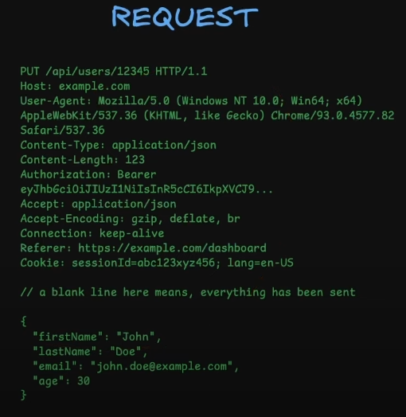
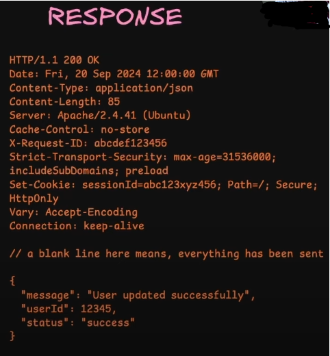

# HTTP

## Introduction

1. It is a protocol through which our browsers(Client) communicates with our servers either to send or receive data
2. 2 ideas which are at the core of HTTP:
   1. Stateless
      1. It means http has no memory of past interactions
      2. Each http request carries all the necessary information for the server to process it.
      3. Thus, each request should contain all the necessary data like authentication tokens, session info.
      4. Advantages:
         1. This stateless arch. simplifies server arch. as the server does not need to store or maintain session info.
         2. Statelessness makes it easy to distribute requests across multiple servers thus helping in balancing the load.
      5. Because http is stateless, developers often implement state management techniques like cookies or sessions or token to maintain continuity in interactions when needed.
   2. Client server model
      1. In http request response flow, there is a client and server always
      2. The client can be browser or an application. It is responsible for providing all the necessary info that the server needs to identify and process the request
      3. The server waits for a request and then processes it and then reverts with a response
      4. HTTP states that the communication is always initiated by the client
      5. To send request, the client and server first need to establish some kind of connection. HTTP uses TCP connections.
3. HTTP versions:
   1. We have the following HTTP versions:
      1. HTTP/0.9
      2. HTTP/1.0
         1. Here, each request opened a new connection with the server which lead to inefficiencies. Also, connection has to be openend and closed for every request and response
      3. HTTP/1.1
         1. Persistent connections are introduced here allowing multiple request and responses over the same tcp connection
      4. HTTP/2.0
         1. Here, multiplexing is introduced which allowed multiple requests and responses over a single connection
      5. HTTP/3.0
         1. It is designed over UPD and not TCP which improved performance with faster connection establishment
4. HTTP request message
   1. Example of a request msg
      
   2. In the above message, we first have HTTP method, `PUT`. Then we have the resource url, `/api/users/12345`. Then we have the http version, `HTTP/1.1`
   3. Then we have headers
   4. Then, there will be a blank line to signify that all the headers are over
   5. Then, we have request body in JSON format
5. HTTP response message
   1. Example of response message
      
   2. First, we have the http version, `HTTP/1.1`, then we have the status code, `200`, then we have the value of the status code, `OK`.
   3. Then, we have some resposne headers
   4. Then, there will be a blank line to signify that all the headers are over
   5. Then, we have the response body in JSON format

### Headers

1. Headers are basically key value pairs
2. Why dont we send the headers info in body? Why we need a separate layer for headers?
   1. In headers, we send some important info that will be used by the server to identify of the request is valid or not. If we send the header info in body, then the servers first need to parse the body and process it to know if the request is valid or not. This will waste a lot of server resources in case of a invalid request.
3. Categories of headers:
   1. Request headers:
      1. Eg:
         1. user-agent:
            1. Tells the type of client like browser, postman, app etc
         2. Authorization
            1. Used to send bearer tokens
         3. cookie
         4. accept
            1. It tells what kind of content we are expecting
      2. These are sent by the client to the server to provide some info about the request
      3. It helps server understand the clients env, its preferences.
   2. General headers
      1. These are used in both Request and Response
      2. These have some metadata about the message itself.
      3. Eg:
         1. date
         2. cache-control
            1. It contains values like no cache or max age of the cache
         3. connection
            1. It tells weather to keep the connection live or not
   3. Representation headers
      1. It primarily deal with the representation of the resource being transmitted
      2. Eg:
         1. Content-type
            1. The format of the request body sent like JSON, XML
         2. Content-length
            1. It describes the size of the resource
         3. Content-encoding
            1. It specifies any encoding like gzip etc applied on the body
         4. ETag
            1. It is a unique identifier mostly used for caching
      3. These headers ensure the client and server know how to interpret the response and request respectively.
   4. Security headers
      1. It enhances the security of the request and response by controlling behaviours like content loading, cookies and encryption
      2. Eg:
         1. Strict-Transport-Security (HSTS)
            1. It ensures that the client only communicates over https preventing protocol downgrade attack
         2. Content-Security-Policy (CSP)
            1. It restricts the sources from which the content like Javascript, CSS, images can be loaded preventing cross site scripting attacks
         3. X-Frame-Options
            1. Prevents the webpage from being embedded in iFrame preventing click jacking attacks
         4. X-Content-Type-Options
            1. Ensures that the browser does not try to guess the mime/type of the content
         5. set-cookie
            1. It secures cookies by making them inaccessible to JS and ensuring they are sent over HTTPS
      3. Security headers helps protect the client and server by controlling how the browser behaves with resources and enforcing security policies
4. Http headers have the following 2 ideas
   1. Extensibility
      1. Http is highly extensible because headers can be easily added or customized without altering the underlying protocol
      2. Custom headers can be added for own specific usecases by the devs
   2. Remote control
      1. HTTP headers act as kind of remote control on the server side
      2. They allow the client to send instructions or preferences to the server, influencing how the server responds or process the request
      3. For example: client specifying the type of content it is expecting from the server in `accept` header.

### HTTP Methods

1. These are actions that client can request on a server
2. Methods define the intent of the interaction
3. Methods:
   1. GET:
      1. To get some kind of data from the server
   2. POST
      1. To create some new record
   3. PUT
      1. To update an existing record data by completely replacing it with new data
   4. PATCH
      1. Update some record in place
   5. DELETE
      1. Used to delete records
   6. OPTIONS
      1. This is used in the CORS flow
      2. This method is used to fetch the capabbilities of the server for a cross origin request which is used because browsers have same origin policy
4. We have idea of idempotent and non idempotent in http methods
   1. Idempotent means no matter how many times the api is called the result will always be tthe same
      1. GET, PUT, DELETE are idempotent
   2. Non Idempotent
      1. POST

## CORS

1. By default, browsers have same origin policy. This means browsers restrict webpages from making request to a domain different from the one serving the webpage.
2. For eg: if you visting same abc.com and there is a webpage served to you. Now, by default, the webpage cannot make call to anyother domain like xyz.com or api.abc.com due to CORS issue. It can only make call to any api hosted on abc.com only.
3. CORS is a security mechanism enforced by browsers to control how web applications interact with resources hosted on different domain
4. Without CORS, browsers block the request made from a web application running on one origin like example.com to a different origin like api.example.com for security.
5. CORS allows servers to specify who can access their resources and how.
6. Flows in Cross Origin requests:
   1. Simple request
   2. Pre-flighted request

### Simple Request

1. Lets say our frontend is at example.com and our server is at domain api.example.com.
2. We made a get request which would look like this:
   ```
    // request
    GET /api/products/123 HTTP/1.1
    Host: api.example.com
    Origin: https://example.com
    Accept: application/json
   ```
3. The browser automatically adds the origin header to indicate the origin of the request
4. Now, once the request reached the server, the server will check for the origin against its CORS policy. If the origin is allowed, the server will include the Access-Control-Allow-Origin header in the response with the requested data

   ```
    HTTP/1.1 200 OK
    Content-Type: application/json
    Access-Control-Allow-Origin: https://example.com

    {
        "product": {
            "id": 123,
            "name": "Example Product"
        }
    }

   ```

5. After server sends the response, the browser looks for `Access-Control-Allow-Origin` header in the response. As the Host domain and Origin are different in the request, the browser check whether the response header has this `Access-Control-Allow-Origin` header or not.
6. If the `Access-Control-Allow-Origin` is present and its value is either same as the request `Origin` or `*` (means all origins are allowed), then the browser will pass on the response to the client
7. If the response, look like:

   ```
    HTTP/1.1 200 OK
    Content-Type: application/json

    {
        "product": {
            "id": 123,
            "name": "Example Product"
        }
    }

   ```

   It means the server didnot add the `Access-Control-Allow-Origin` CORS header or the particular request origin is not allowed, then the browser will block the response to reach the client for parsing and `CORS error` will be thrown

### Pre-Flighted request

1. Conditions based on which browser decides if it is a simple request flow or preflighted flow. If anyone of the following conditions becomes true, the request will be considered as preflighted request:-
   1. The method is not GET, POST or HEAD
   2. The request includes non-simple headers like Authorization, X-Custom-Header etc
   3. The request has a content-type other than `application/x-www-form-urlencoded`, `multipart/form-data` or `text-plain`
2. One condition is must that the request should be a cross origin request and if anyone of the above conditions is true, then the browser will consider the request as Pre-Flighted request.
3. A preflight request is made with an `OPTIONS` method
4. A preflight request looks something like:
   ```
    OPTIONS /api/resource HTTP/1.1
    Host: api.example.com
    Origin: https://example.com
    Access-Control-Request-Method: PUT
    Access-Control-Request-Headers: Authorizartion
   ```
   1. The preflighted request has the request method as OPTIONS followed by resource url and Http version
   2. Here above, Access-Control-Request-Method is asking the server if `PUT` method is available, for the `/api/resource` route, or not
   3. Access-Control-Request-Headers ask if the `Authorization` header is supported in server or not
5. Before the actual request from client, the browser will send the preflighted request or OPTIONS request to the server (at api.example.com). This request does not include the actual data. It is a general enquiry to the server about its capabilities.
6. If the server is properly handling the CORS flow and supports the cross origin requests, it will respond something like:
   ```
    HTTP/1.1 204 No Content
    Access-Control-Allow-Origin: https://example.com
    Access-Control-Allow-Methods: PUT, DELETE
    Access-Control-Allow-Headers: Authorization
    Access-Control-Max-Age: 86400
   ```
   1. 204 status code is returned which signifies no body in the response
   2. `Access-Control-Allow-Origin` specifies the origin supported by the server as a valid cross origin request maker. It can also have value `*` which means all types of origins are allowed
   3. `Access-Control-Allow-Methods` specifies the methods allowed for `/api/resource` route
   4. `Access-Control-Allow-Headers` specifies the headers allowed for requests
   5. `Access-Control-Max-Age` asks the browsers to not to make any preflight request to te server regarding the `/api/route` route for the next 86400 seconds or 24 hours as there will be no change in the server regarding the CORS config for /api/route
7. If the CORS are not supported on the server side, it will send no response and the browser will simple throw the CORS error
8. After the preflight request is successful and verified, the browser will forward the original `PUT /api/resource` request that the client was sending to the server and the server responds according to the original request
