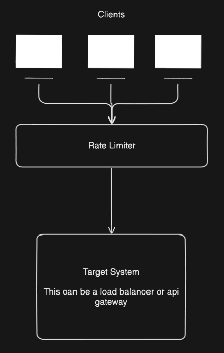
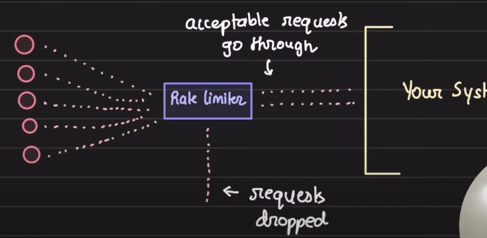
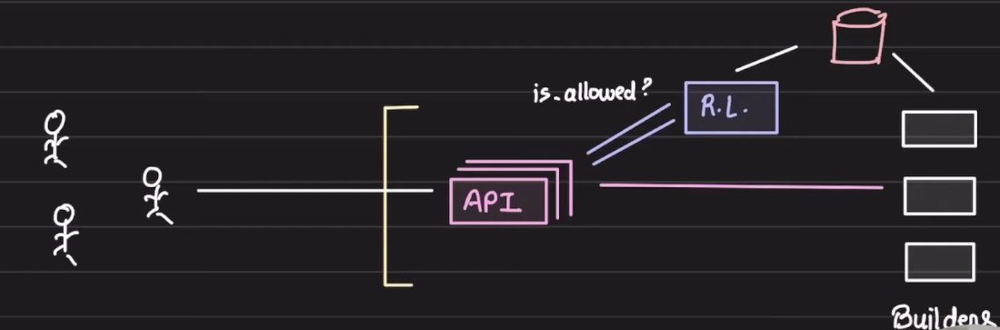
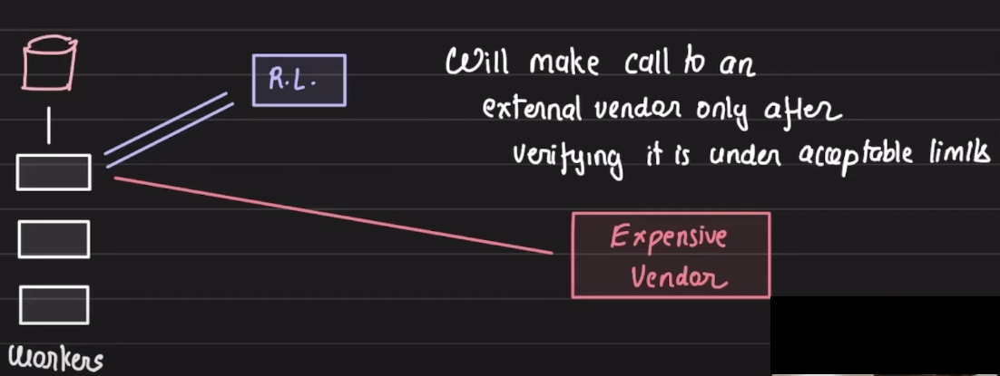

# Rate Limiting and Throttling

## Throtlling

1. Throttling is a technique that ensures that the flow of data/request being sent to the target system is sent at a rate which is accepted by the target system
2. For example, you have a server running which can handle 1000 requests per minute but on some minute, 1M requests comes to your system. Without throttling with the help of rate limiter, your server may go down due to the overwhelming number of requests
3. We need to use a component called `Rate limiter` which ensures that the requests are forwarded to the system at an acceptable rate.  
   
4. Throttling is generally percieved as a Defensive measure. Means we are being defensive about our system non going down.
5. 3 potential things that the throttling mechanism would do if there is surge in number of requests:
   1. Throttling could be slowing
      1. Here, when a lot of requests come to our rate limiter, it will slow down the requests and slowly drips the requests to the target machine
      2. Here, the rate limiter will be acting as a buffer similar to a queue. The requests will be buffered in the rate limiter and slowly sent to the target system for processing them
      3. This can be used where asynchronous communication is possible
   2. Throttling could be rejecting
      1. If the requests comming to the system are larger than a particular number, set in rate limiter, then the rate limiter will simply reject those extra requests
      2. If might return status code `429` stating too many requests comming to the system
      3. This can be used in Synchronous communications
   3. Throttling could be ignoring
      1. Here, the rate limiter will simply ignores the extra requests comming to the system instead of rejecting it and sending `429` or any other status code
      2. This can be used to fool an attacker thinking that his DDOS attack is causing issues to the server as its is not getting any error status code from the server
6. We have use the combination of above 3 methods based on the endpoint

### Need for Throttling

1. To prevent system abuse
   1. Rate limiter ensure that the system will not go down if a lot of requests comes may be from an attacker
2. To only allow traffic that could be handled
3. Control consumption cost
   1. For serving a request, we use compute power of EC2 machines or some cache etc
   2. If we are processing a lot of requests and spinning up a lot of infra, it might increase the bills
4. To prevent cascading failures
   1. If one system is overwhelmed with a lot of requests comming to it and it gets down, there might be some other systems dependent on it, they will also suffer thus leading to cascading failure of systems

## Usecases of Throttling

1. Prevents catastrophic DDOS attacks
   1. Any request that comes in to your system, first hits the rate limiter. Rate limiter will ensure that it only forward the requests that can be handled by the infra and is a legitimate request
   2. The non-legitimate requests can be filtered by checking if there is any surge in requests for a particular IP or from a particular user or from a particular access token
   3. The rate limiter will be configured to accept a particular number of requests from an IP or user or access token in a given time period
   4. The extra requests will be dropped
   5. This is an example of an External Rate Limiter, where the rate limiter is directly facing the user/client  
      
2. Gracefully handle the surge of users
   1. This is the case where all the requests comming to your system are legitimate but they are huge in number
   2. It might be the case that the requests comes to your system but your infra is not scaled enough to handle those
   3. The request will hit the rate limiter first and if the number of requests is too high, the rate limiter can be configured to return a custom response like "The website is facing too much traffic, please revisit after some time" rather that returning a generic error like `503`
   4. Some requests will pass and some will be dropped
   5. This is also a usecase for External rate limiter
3. Mutitiered limits
   1. Lets say we are a CI/CD company, for example CircleCI, which offers multi tier pricing based on the build time offered  
      
   2. Now, when the user requests the api server to build something. The request will come to the api server and the api server before processing the build request, it first asks the Internal rate limiter to check if the user has enough build time left to process the request. It check for the user quota with the internal rate limiter before processing the request.
   3. The build workers will keep pushing the build stats in the database and the rate limiter will use the database to see the how much each customer has consumed  
      
4. You are not overusing a 3rd party system
   1. Suppose for processing the request, you are consuming an expensive 3rd party api and their pricing is aggresive say 5$ per request
   2. An internal rate limiter will prevent overuse of the 3rd party api by the system by rejecting the processing of the request if the set quota of the external vendor for the time is exceeded
      
5. Not overwhelming your unprotected system
   1. Hard deleting from DB is a very expensive operation. If yout have to hard delete 10M rows in one query, it would cause the DB to slow down.
   2. Thus instead of deleting all 10M rows in one go, we can distribute and limit the number of rows that will be deleted in a particular time frame. Thus protecting the DB from slowing down
