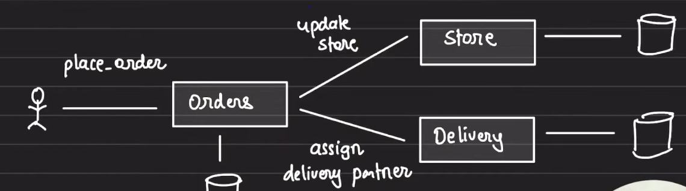
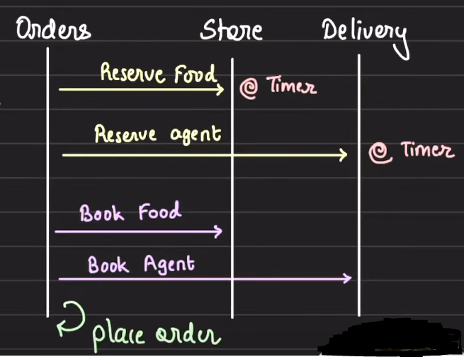

# Distributed Transaction

## Distributed Transactions

1. A trasaction that span over multiple physical systems, machines or computers

## 2 Phase commit

1. Lets take an example of a food delivery app, `Foody`, which ensures 10 minutes food delivery. Foody has dark stores available all across the city where they keep the food items and whenever a order comes the food is warmed and handed over to the delivery partner for delivery
2. Now, to guarantee that the food will be delivered in 10 mins, following conditions need to meet:
   1. Required food items are available in the store
   2. Delivery partner is available to deliver the food
3. This is a classic case of distributed txn.
4. You have an `Order` service which updates the placed orders in the DB. Order service needs to communicate with the `Store` service which keeps track of the food items in the DB. Order service also needs to communicate with the `Delivery` service, which keeps track of the delivery partners.  
   
5. For an order to be placed for 10 minutes delivery, we should have required food booked in store service and a delivery agent booked in Delivery service.
6. If any one of the booking fails, then 10 minutes food delivery cannot be assured. It means either both the services, store and delivery, will book the respective things and then the order will get placed or nothing will executed.
7. 2 phase commit can help us solve this problem

### 2 phase commit

1. There will be 2 phases for the above flow:
   1. Prepare Phase
   2. Commit Phase
2. Prepare phase is all about reserving items
3. Commit phase is all about assigning or booking the items
4. Now, the flow will be:
   1. At first, the Order service will call the Store service with request to lock/reserve the order food items in DB. The items will be locked with a timer to ensure that if things go wrong the order cannot be fulfilled then the locked food items gets released after the lock time is over.
   2. Then, the order service will make a call to the Delivery service to lock/reserve a delivery agent in DB. The delivery agent will also be locked with a timer in DB
   3. Note: In this phase the execution of the order will not start.It means in this reserve phase, we are just checking and locking the food and delivery agent to know their availability. If both, the food and delivery agent is available then we can take the order and start executing it. It anyone of them is unavailable then 10 minutes order delivery can't be ensured and we will reject the order.
   4. Now, if both the locks are acquired then the order service will register the order in DB.
   5. After registering the order, order service will send a request to Store service assigning the order Id to the locked/reserved food items, resulting in store start warming the order to be picked
   6. And, order service will send a request to the Delivery service assigning the same order id to the locked/reserved delivery agent so he can reach the store to pick the order to be delivered.  
      
5. Reservation Phase scenarios
   1. If both locking fails, transaction fails, we abort.
   2. If only one succeeds, we cancel the resevation of another and abort the whole trasaction or the timer will release the locks
   3. If both succeeds, we move to the commit phase
6. Commit phase scenarios
   1. If both succeeds, the order is placed
   2. If anyone fails, we cancel the reservations and abort
7. Advantages of 2 phase commit
   1. Guarantees Atomic transaction
      1. Either everything succeeds or we abort the whole trasaction
   2. Guarantees Isolation
      1. Once things are locked/reserved, no one else is able to access them in the timer period or in a successful transaction
8. Disadvantages
   1. The transactions are slow as we have to acquire locks first and them commits
   2. These are prone to deadlock. Multiple transactions can engage in a deadlock so deadlock detection algo should be run continously to detect and abort those txns
