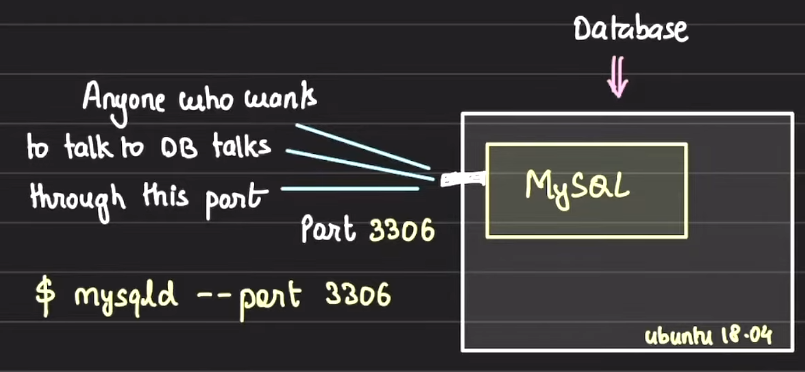

# Embedded DB

### Intro

1. Generally we have a dedicated database server in our system. It means we have a machine, say Ubuntu machine, having a DB process running on it. Our API servers connect with the database server and them perform CRUD operations on it  
   
2. Embedded Database
   1. Suppose you have a profile service running on a machine. This profile service talks to the external database, on a separate server, and fetches the user's profile data.
   2. After fetching the profile data, the data is cached into the service itself so in case of again asking for profile data, the data will be served from cache itself.
   3. The profile data can be stored in an in-memory hash table or we can have files created with user id as the name and saving the user profile data into the file and ultimately saving the file on the profile service' server disk.
   4. The in-memory hash table or the files are contained within the profile service. If someone wants to directly connect to the hash table and try to fetch the data, they can't. They have to use the profile service for getting the data.
   5. If the profile service crashes or the server crashes then the hash table and the files saved will be deleted forever.
   6. These types of stores/database are called as Embedded database
   7. Here, in embedded database, we dont have to spin up any process seperately. Instead, we use the memory or disk of the service to store the data.
   8. The embedded DBs are part of parent process. If the parent process dies, the data will not be accessed
   9. We have some dedicated embedded databases in the market as well

### Famous Embedded databases

1. SQLite:
   1. It is an embedded SQL database
   2. Whenever you start a django server, the default database it uses is SQLite. It creates a sqlite.db file.
   3. SQLlite basically creates a file where the database info, tables and data inside the tables reside.
   4. SQLite offers an SQL interfaceto deal to perform CRUD opertion on data and tables stored in the sqlite.db file
   5. The data will be lost if the sqlite.db file is deleted
   6. The SQLite is confined to a process
2. LevelDB
   1. It provides a disk key value store
   2. It is developed by Google
3. RocksDB
   1. It also provides a disk key value store but is optimized for performance
4. BerkleyDB
   1. It provides a key value store with ACID, locking, replication etc features

### Applications of Embedded DB

1. High write throughput:
   1. If your service is getting very high number of writes, you can use an Embedded DB in the service to save those writes and then use a separate service to take out those writes and inplement on to your actual DB residing on a separate machine
2. Daily life implementation
   1. Browsers has an Indexed DB, under the storage tab, which is an embedded DB. Browsers used the indexed DB as well as exposes it to be used by us as well for caching the pages, browsing history etc
   2. Mobiles use SQLite for the same

Thus, if the data can be confined within a space, you can use an Embedded database to store and retreive the data.
