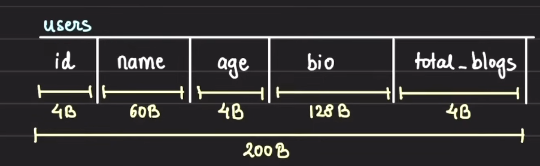
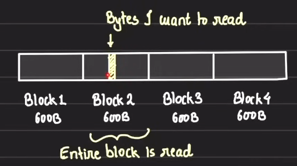
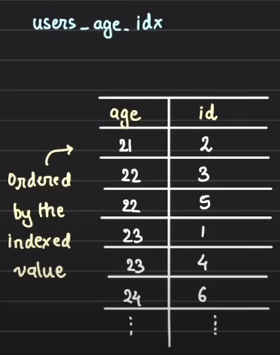

# Indexing

## How indexing makes database faster

1. Database is a collection of records
2. In terms of Relation Database like SQL, the data is repersented as collection of rows grouped into tables and in terms of Non relation database like MongoDB, the data is represented as collection of JSON docs.
3. All the data in these DBs needs to be serialized first and then store in physical storage.
4. Lets take example of Sequential Serializtion, lets say we have a users table with 5 columns as shown in the figure below. Each attribute  
   
5. As we can see each user record's attribute is going to take up some space in the memory. From the image it is clear that an user record is going to take up total 200 Bytes in the memory.
6. Lets say we have total 100 user records so the total size of the users data will be 100 x 200 = 20000 Bytes

### How reads from the disk happen

1. Whenever some data is read from the disk, even 1 Byte of data, entire block, where that data is stored, is read from the disk.
2. Each disk, whether it is SSD or Magnetic Disk, is split into blocks. These blocks are consecutive in orientation.
3. Standard block size is 4 KB which is also configurable. In our case, lets take the block size as 600 Bytes.  
   
4. If we want to read a single byte from the disk, the disk I/O will fetch the entire block containing that data byte into the memory for reading and processing of the required byte.
5. Now, our record size is 200 Bytes and our block size is 600 Bytes. So in each block, we are going to store 3 records (600 / 200 = 300)
6. The entire users table data containg 100 records will be stored in total of 34 blocks (100 / 3 = 33.33 blocks)
7. So, reading the entire table will require the database engine to read 34 blocks from the disk. Lets assume it took 1 sec to read one block from the disk, then reading the entire table will take 34 secs.
8. Lets say we want to fetch all the records with age == 23, then we need to iterate through each row and find if the record has age == 23. This will involve reading the entire table and thus all 34 blocks will be read and hence it will take 34 seconds

### Indexes

1. Indexes are very small referential tables that holds row references against the indexed value.
2. Indexes generally contains 2 columns: the indexed column, arranged in sorted order of its value, and the primary key of the table. The primary key acts as a reference to a record and used to identify the block in which a particular record is stored.
3. Now, lets say we want the records with age == 23, lets create an index on the column age.  
   
4. The index will also be stored on the disk. As we know, the age column took 4 Bytes and the id (primary key) column took 4 Bytes so each record in the user-age index is going to take 8 Bytes (4 + 4)
5. There are 100 records so our users-age index is going to take total of 800 Bytes (100 x 8 = 800) in the disk
6. Since each disk block can hold 600 Bytes of data so the whole index will be stored in 2 Blocks ( 800 / 600 = 1.33) in the disk.
7. We iterate over the index first and then filter out the records ids that suits our query. These ids are then used to fetch actual data from the table.
8. Now, if we have some query where we need to iterate through whole index and then identify the records to be fetched from actual blocks where the table data is stored. Iterating through all the entries in our index will require reading 2 blocks which will take 2 seconds and after that suppose our desired table records are present in 4 blocks which is going to take another 4 seconds to read those records from the disk. Thus, it took total 6 seconds [2 (for reading whole index) + 4 (for reading desired records in blocks)] for getting results from the query.
9. Previously without the index, it took us 34 seconds to fetch the data as we have to read all the 34 disk blocks. But in above case, it took 6 seconds to get the desired data.
10. If you are querying on a column which is not indexed, the query is going to take long as it has to go through all the records. Thus, if you have a column in the table which is queried frequently, you need to create an index on that column.
