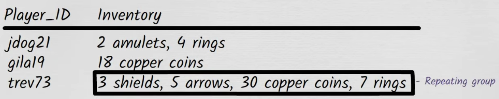
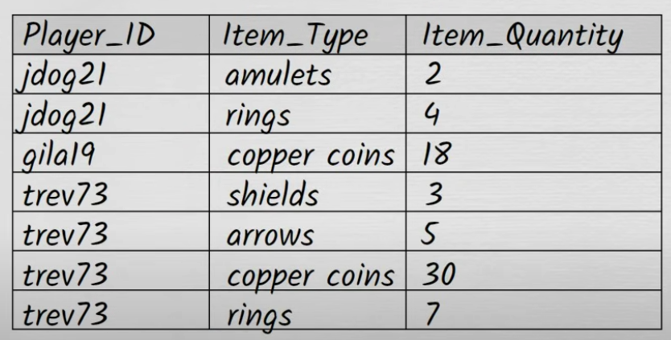
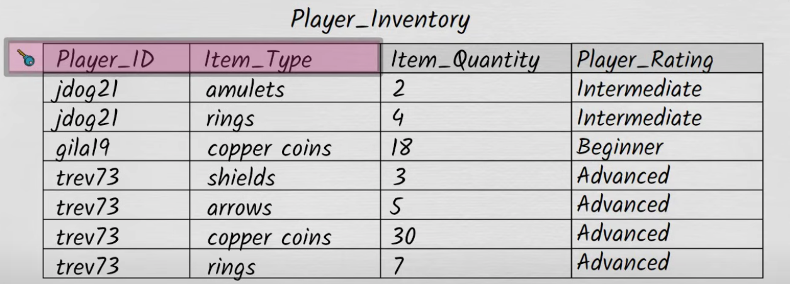
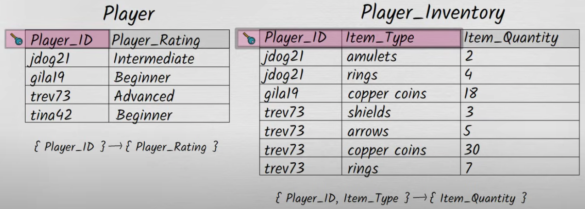
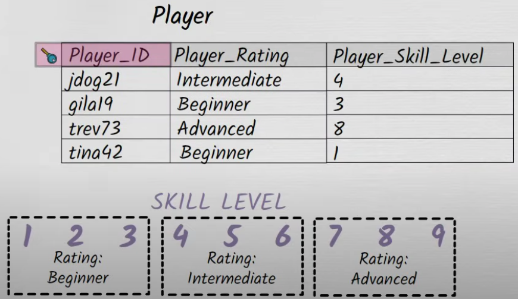
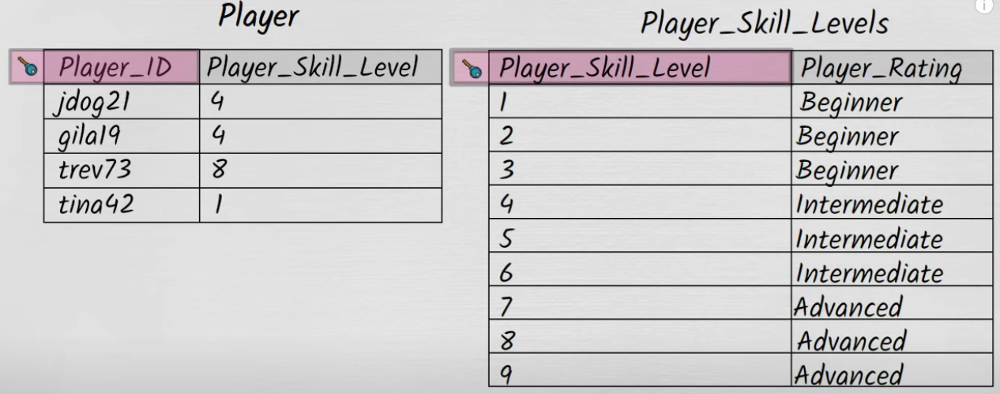

# Normalization in DB

## Need for Normalization

1. Suppose you have a table storing the user_id and user_dob and you found that for some user_ids, there are multiple date of births present. This questions the integrity of the data.
2. This is due to bad database design or when the database is not normalized
3. Normalization is needed to prevent table from keeping redundant and inconsitent data in it.

## Normalization meaning

1. When the database tables are normalized, the tables are structured in such a way that they can't hold redundant info.
2. Normalized tables are:
   1. immune from holding inconsistent and redundant data
   2. Easier to understand
   3. Easier to enhance and extend
   4. Protected from
      1. insertion anomalies
      2. updation anomalies
      3. deletion anomalies
3. There are basically 5 normal forms:- 1NF, 2NF, 3NF, 4NF, 5NF
4. These normal forms tells the level of safety a table provides from keeping redundant data into the table. 1NF table provides the least level of safety and 5NF ensures maximum safety  
   

## 1NF

1. Using row order to convey information violates 1NF
   1. Suppose you have a users table with just one column user_name. If you are storing users' user_names in the order of their increasing heights, it will violates the 1NF as another person looking at the table will not be able to understand that the user_names are organized in a particular order until told explicitly.
   2. If you really want to keep the store usernames in the order of increasing heights, you can add a heights column into the table along with the username. This is will easily tell anyone that the data is organzied in the order of heights
2. Mixing datatypes for a column
   1. We cannot store multiple datatypes like string, integer etc under the same column. If yes, then it violates the 1NF.
   2. Each column should have one datatype assigned to it and all the values, stored in the column, should be of same data type.
   3. Mixing datatypes within the same column violates the 1NF
3. Designing a table without a primary key
   1. Primary key is a column or combination of columns that uniquely identifies a row in the table.
   2. If there is no primary key present in the table, then it violates the 1NF
   3. Having primary key in the table helps in preventing keeping mutiple rows for the same primary key value as primary key is unique in a table
4. Presence of repeating groups in the table
   1. Suppose we have a table containing info about the player_id and its game inventory. Each inventory contains many different types of items. When a values contains multiple potential values in it then we call it a repeating group.  
      
   2. Querying data for a partcular inventory item is very complex in this situation
   3. Thus, storing a repeating group of data items on a single row, violates the 1NF
   4. We can have the following setup to prevent repeating grps. Here, the primary key is the combination of player_id and item_type  
      

### First Normal form rules

1. Using row order to convey information is not permitted
2. Mixing data types within the same column is not permitted
3. Having a table without a primary key is not permitted
4. Repeating groups are not permitted

## 2NF

1. Suppose, we introduced a new column for player_rating in our player_inventory table. Since player rating is related to player only so we will have multiple entries of the player_rating whenever we encounter a specific player id.  
   
2. This is not a good table design. As we have rows with duplicate player_ratings. Also, suppose the player record, gila19, is deleted and if we want to find its player_rating, we are unable to do that because the there was only one record with player rating info for gila19 and its deleted. This problem is known as **Deletion anomaly**.
3. Deletion Anomaly
   1. A deletion anomaly happens when deleting one piece of data unintentionally causes the loss of other valuable data.
4. Now, as we can see the player, jdog21 has 2 entries in the table and his rating improves from intermediate to advanced. Ideally, we should be updating the player_rating for jdog21 in all the places in the table. But due to some reason, we forgot to update the rating in some places. This will result in inconsistency for player rating for jdog21. This problem is called an **update anomaly**.
5. Update Anomaly:
   1. An update anomaly happens when the same data is stored in multiple places and updating it in one place but not everywhere causes inconsistency.
6. Suppose a new player, tina42, comes with player_rating as beginner but she does not have anything in her inventory yet. Although, she is a new player with a rating but as she does not have anything in her inventory, we cannot add her record into the player_inventory table. This problem is known as **insertion anomaly**
7. Insertion Anomaly:
   1. An insertion anomaly happens when you cannot add new data without also adding unrelated data.

### What is 2NF

1. 2NF is all about how a tables non key columns relate to the primary key
2. In our table, the non-key attributes are item_quantity and player_rating.
3. Non key attributes/columns are those that dont belong to the primary key.
4. 2NF says:-
   1. Each non key attribute must depend on the entire primary key.
5. Here, in our case, the item_quantity is completely dependent on the primary key i.e player_id + item_type. But, player_rating is only dependent on the player_id only and not the entire primary key.
6. Thus, we can create a new separate table containing player_id (primary key) and player rating.  
   

## 3NF

1. Suppose, we have player skill levels ranging from 1 to 9.
2. The players with skills:
   1. 1,2,3 :- beginner rating
   2. 4,5,6 :- intermediate rating
   3. 7,8,9 :- advanced rating
3. Now, lets introduce a new column player_skill_level in the players table.  
   
4. Here, both the columns represent the same information i.e. players skills in the game.
5. Suppose, player gila19's skill level moves from 3 to 4, then we need to update both player_skill_level and player_rating as it now falls in intermediate rating. Suppose, we fail to update the player_rating for gila19, then it will lead to data inconsistency.
6. Here, player_rating is kind of dependent on player_skill_level. Thus we have a transitive dependency in the table
   1. player_id --> player_skill_level --> player_rating

### 3NF

1. 3NF does not allow the dependency of a non key attribute on another non key attribute in the table.
2. We can remove the player_rating from player table and introduce a new table, player_skill_levels stating the player_rating w.r.t player_skill_levels
   
3. Thus, 3NF states that:
   1. Every non key attribute in a table should depend on the key, the whole key and nothing but the key.
4. Normalization upto 3NF ensures fully normalized tables upto 99% of times

### BCNF (Boyce-Codd Normal Form)

1. Its a slight variation of 3NF
2. BCNF states that:
   1. Every attribute in a table should depend on the key, the whole key and nothing but the key.

## 4NF

1.
