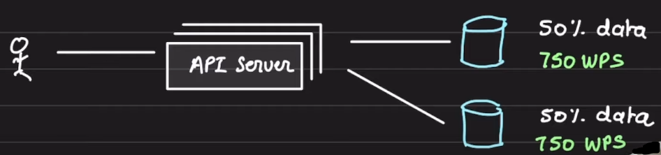
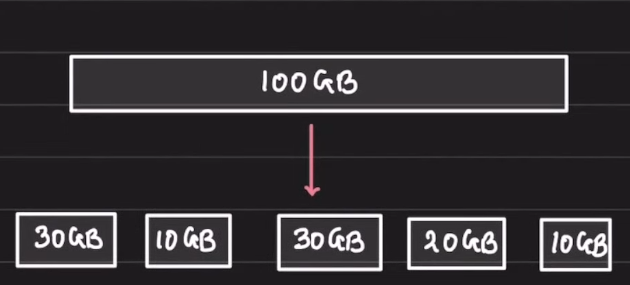
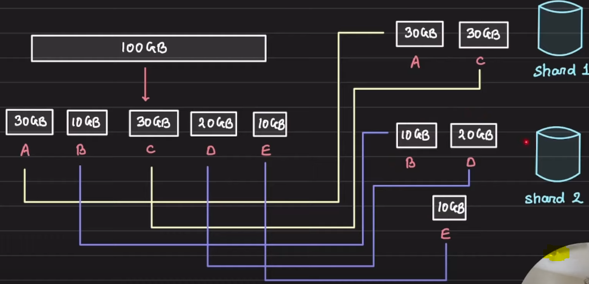
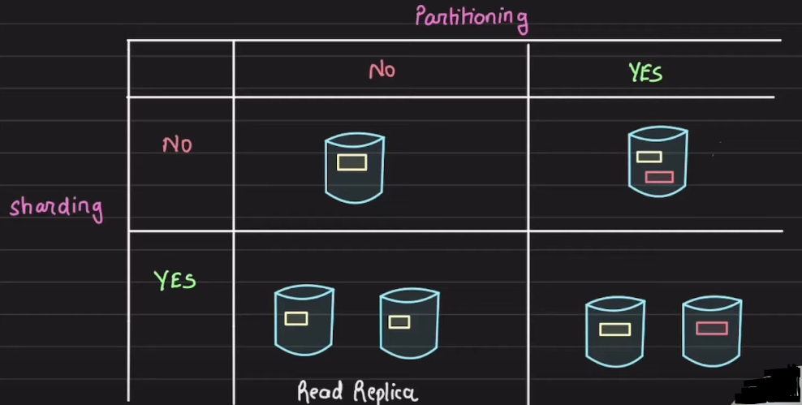

# Sharding and Partitioning

1. Both Sharding and Partitioning helps improve the throughput and availablility of the DB.
2. Sharding:
   1. Method of distributing data across multiple machines
3. Partitioning
   1. Splitting a subset of data within the same instance

### How a database is scaled

1. Generally, you have an EC2 server where you install mysql server and start the process. Thus this EC2 server becomes the database server. The database process exposes a port, ideally 3306 incase of mysql, through which the external service can access and perform CRUD operations in the database
2. In simple words, a database server is just a database process (mysqld or mongod) running on an EC2 machine
3. In the database server, the database process will use the local disk space of the EC2 instance where the data will be persisted. If we dont want to loose the data, in case anything happens to the EC2 instance, we can attach an AWS EBS volume to the EC2 instance and config the database to use it
4. Suppose, you have the single database server which is easily handling 100 wps (writes per second). Now, suppose the number of writes on the database suddenly increases to 200 wps and you thought to vertically scale the DB server instance by increasing the RAM, CPUs and Disk size.
5. After vertically scaling the DB for increases number of writes, you also created a read replica of the DB to support large number of reads as well. Thus, the master database server will be available to do critical/real-time reads and all the writes while the read replica will be used to perform read operations. There will definitely be a slight delay in syncing/copying new data between master and read replica
6. Now, suppose the number of writes increases to 1000 wps, we again need to scale up the instance. But there is always a limit to the vertical scaling of a server due to hardware limitations
7. There is a need to Horizontally scale the database to incorporate the increasing demand of writes.
8. In horizontal scaling, we have to split the data so that we can spin up a new database server and both the servers combined together will handle the write load. Suppose load of 1500 writes is comming to the system, now due to horizontal scaling a the load will be equally distributed amoung the DB servers
   
9. Here above, the another data node or database server that we added is a shard and the data is partitioned amoung 2 shards.
10. Thus, whenever we horizontally scale the master DB, by creating other master data node, we `partition` the data amoung the all the master nodes. All the master nodes are known as `Shards`
11. **The database server is sharded and the data is partitioned amoung the shards. Shard is at the database level and partition is at data level**
12. Suppose we have a database server which has 100 GB worth of data which is pretty high. Lets partition the data into smaller chunks, as shown below, using a partitioning strategy  
    
    1. All the partitions have to be mutually exclusive means data present in one partition must not be present in another
    2. We can put all the partitions into one database server or we can keep them into multiple database servers known as Shards
13. Suppose we have 2 Shards then we need to split the above 5 partitions across those shards  
     
    1. Now to acces a particular data, say which is saved at partition B, you need to make request to the shard holding the partition which is shard 2 in this case

### How to do partitioning

1. There are 2 categories of partitioning:
   1. Horizontal Partitioning
      1. It operates at row level
   2. Vertical partitioning
      1. It operates at column level
2. The way of partioning the data needs to be decided based on the load, usecase and access pattern

### Partioning and Sharding

1. We can have the following 4 scenarios:  
   
2. In the scenario where we dont have partitioning and sharding in database server is the initial setup that we have while creating an application
3. In the scenario where we have partioning but no sharding has an example where you have MySql database server running and you create 2 databases in the same DB server. The 2 DBs may be catering 2 different applications
4. In scenario where you have sharded the DB but not partitioned it is the case of read replicas as both master and read replica has the exact copy of the DB. This is generally used to handle large amount of reads
5. The final scenario is where we have partioned tha data and the partitions are distributed across the different DB servers or Shards. This is done to handler higher write throughput

### Advantages of Sharding

1. Handle large reads and writes
2. Increase overall storage capacity, as we have multiple DB servers, we can utilize the storage of those
3. Higher availability, if one of the shards go down it will not impact the whole application but a part of it

### Disadvantage of Sharding

1. Operationally Complex
2. Cross shard queries are expensive
