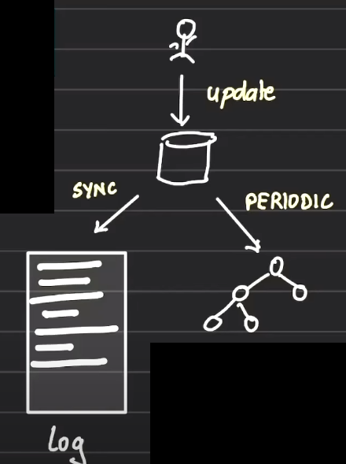
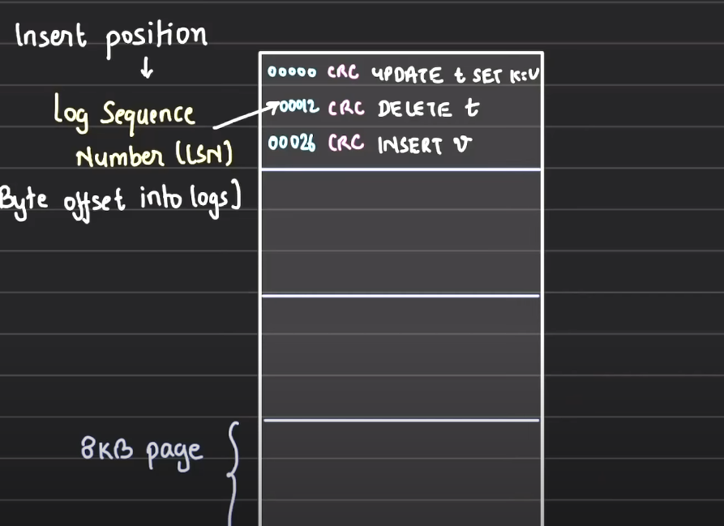

# Write Ahead Logging in DB

### Need for Write Ahead Logging

1. Every persistent DB needs to be reliable means every update you fired onto the database needs to be reliably stored onto the disk
2. Every DB CRUD transaction that is commited needs to be persistent even when there is any failure/crash/restart in the system. Whenever the system is recovered from the commited transaction should all be present there.
3. Write Ahead Logging in DBs ensure this

### What happens on committing the changes

1. After firing an update query onto the database, you commit the transaction. On commit, the changes made by the query are flushed to the persistent storage or any non volatile storage/disk.
2. A persistent or non volatile storage is that storage which is not prone to power loss, OS failure and hardware failure witout damaging the disk
3. As soon as an data update query on a table is fired and committed, the corresponding blocks in the disk where the table data is present are updated and if there is any indexes present on that table, those will also gets updated in the disk blocks. It means, update queries on the database triggers a sequence of disk writes.
4. Disk writes are complicated
   1. The updates are first done on the memory and then added to in memory flush buffer.
   2. From the in memory flush buffer, it is flushed onto the OS buffer cache. Every OS has a cache where the disk blocks are cached
   3. From OS buffer cache, the changes are flushed to disk cache. This disk cache generally caches the frequently accessed disk blocks
   4. Then finally the changes are made to the SSD or HDD.  
      
   5. So whenever something is to be written on the disk, by default the four stages the changes pass through
   6. We can skip these cache stages, by opening the files in sync mode. It means generally, we used to open files in "w", "r", "a" mode. These mode update the data in all the above mention four places. But we also have options to open files in sync mode. in sync mode, the updation on the caches are skipped and the changes are directly propogated from memory to disk

## Write Ahead Logging (WAL)

1. This is a very standard method of ensuring data integrity
2. Core idea:
   1. Before making changes to actual datafiles (tables and indexes), log those update sql queries to a log file.
   2. The log file should be opened in a sync mode.
   3. As part of your commit, the changes query/queries should be first logged into the log file and then should be performed on the database  
      
3. By logging first, you dont have to immediately flush the actual database changes to the disk to prevent dataloss from failure. You have logged the query that made the change and then you can may be send the actual database changes to disk in batches.
4. In case of any failure while writing the actual database changes to the disk, you need not worry as you still have the query that made that change and you just need to rerun the query
5. Note: The log file will only have data manipulation and table manipulation queries as logs not the READ queries
6. WAL is by default enabled by all the databases and should not be disabled.

### Advantage of WAL

1. We dont need to immediately flush the data changes to disk on every commit. This also improves the database performance as the disk writes need not be performed immediately. We can retain the changes in memory and save them to disk async
2. In case of a database crash, we can recover by replaying the logs from the WAL log file. The changes that were present in the memory and not on the disk can be recovered easily by replaying the queries from the last commit on to the disk.
3. It reduces the number of disk writes
4. Point-in-time recovery is easy. It means if you have say 100 queries in your log file and you only want the database changes till say 60 queries, you can easily get that by running only the 60 queries in a new database. Thus you will be able to know the state of your data after Nth query.

### Data Integrity in WAL file

1. Whenever you write something onto the disk, it needs to be protected. Lets say, you are writing a line onto the disk and in between the process crashes. It may result in having a partial write onto the disk.
2. Suppose you are writing a very long query onto the log file with say having 10 where conditions. But while writing the query in the log file, process craches and you have the query with say 6 where conditions only. Now, since the query is partial, if you run it to recover the database in case of crash, you will get a different result.
3. Thus, every individual record in WAL is `CRC-32` protected.
4. CRC stands for Cyclic Redundancy Check.
5. CRC ensures the record that is written on your file are intact, proper and not middeled by anyone in between.

### Structure of WAL file

1. WAL is an append only file.
2. WAL contrains multiple set of files, each file is called as a Segment.
3. Each segment is roughly 16 MB big.
4. In each file, we have Pages. Each page is of size 8 KB.  
   
5. Each record in the log file has an idetifier assigned to it known as Log Sequence Number (LSN)
6. The LSN is the byte offset of the record in the log file
7. The total reads are identified by Segment, Page and LSN number.
8. After the LSN, it writes the CRC and the DB query.
