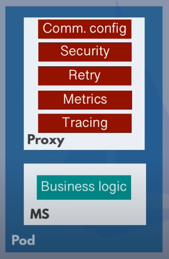
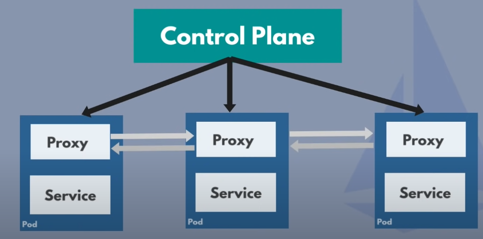
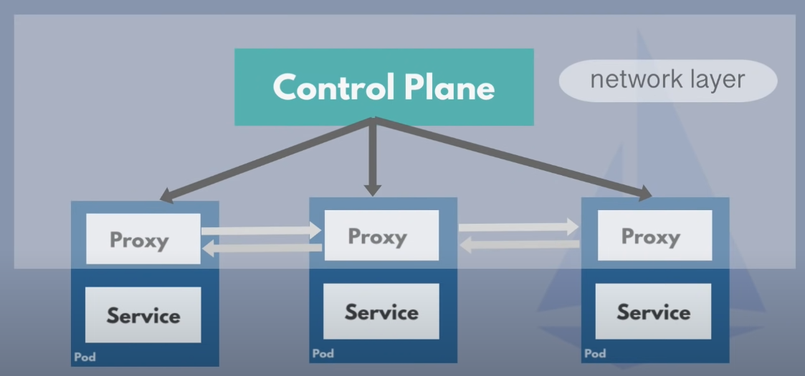
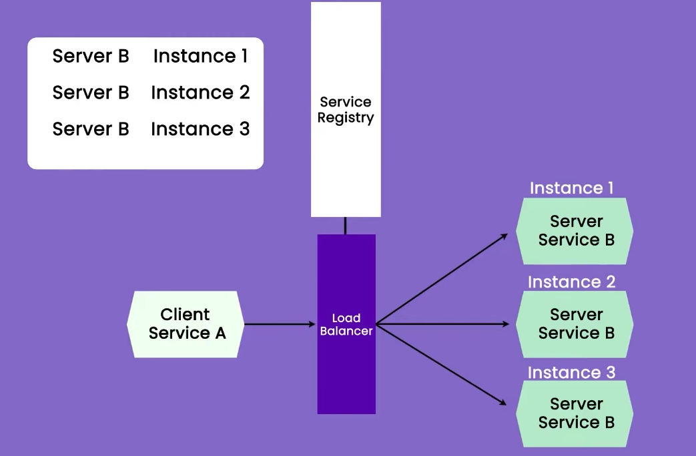
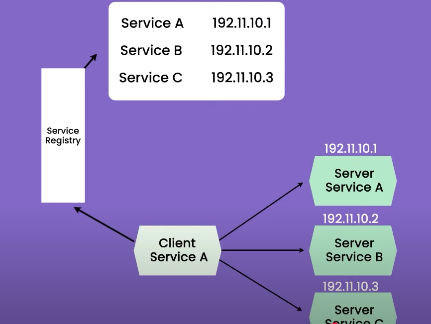
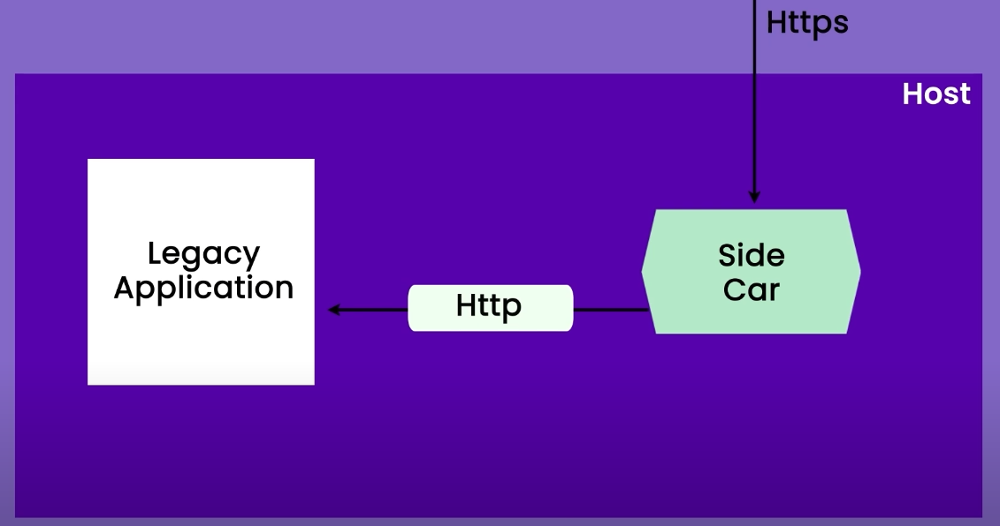

# Service Discovery

### Need for communication between client to service or service to service

1. We can have multiple microservices and there are situations where these microservices communicate with each other in order to fulfil requests
2. Suppose a request comes to a microservice for some data and it needs to communicate with some other microservice to fulfil that request. The microservices must know how and where to communicate the other service for data.
3. There are multiple ways using which the microservices communicate with each other:
   1. Exposing HTTP endpoint:
      1. Here, all the microservices expose an http endpoint and that http endpoint is used by other microservices to send request or communicate.
      2. Suppose, we have 3 microservices S1, S2 and S3. Each microservice has multiple service instances running and all of them are behind the some load balancers. All the services S1, S2 and S3, have the following http endpoints, s1.example.com, s2.example.com and s3.example.com, pointing to load balancers of S1,S2 and S3 repectively
      3. Now, if a service, say S1, wants to talk to another service, say S2, it should have known the http endpoint of that service and then only communication will happen between them.
      4. The services generally communicate using REST calls to other services.
      5. All microservices should have the http enpoint of all the other microservices in order to communicate with them
      6. The challenge here is when we deploy a new microservice, we need to update all the other services with the new endpoint of the new service
      7. Each microservice heer should have the following things:
         1. Business Logic
            1. The code/logic written to perform designated tasks by that microservice
         2. Communication config
            1. The http endpoint of all the other microservices that will be used to communicate with them
         3. Security
            1. Generally, all the microservices are put in a cluster with mutiple pods behind a firewall or proxy, acting as a security layer from the external traffic
            2. But, there is no such security inside the cluster. Once request gets inside the cluster, after passing the proxy or firewall, microservices communicate with each other over http or some other insecure protocol.
            3. Also, services can talk freely to any other service inside the cluster.
            4. Thus, each microservice should have additional logic and configuration ensure secure communication amoung the services within the cluster.
         4. Retry logic
            1. To make the whole application more robust, we need to implement retry logic in all the microservices
            2. If some microservice loose the connection during communication, there should be a retry logic implemented to retry the communication with the lost microservice
         5. Metric and tracking logic
      8. All the teams of developers needs to add the above things in there microservices along with the business logic.
      9. The teams add a lot of non business logic things to their microservices and this adds some complexity to these services.
   2. Service Mesh
      1. This also manages communication between microservices
      2. Sidecar application/proxy:
         1. We can extract all the non business logic elements from the microservice and add it to a seperate application/proxy which shares same resources with the microservice.
         2. This proxy/application is called Sidecar proxy/application  
            
      3. Sidecar:
         1. handles all the networking logic
         2. acts as a proxy
         3. This can be a third part application that cluster operators can easily configure
         4. Developers can focus on developing the actual business logic
         5. All the communication to the service will happen using this sidecar proxy.
      4. Control Plane
         1. it injects the sidecar proxy in every microservice pod  
            
         2. The microservices can talk to each other through the sidecar proxies.
         3. It contains info and location of all the sidecar proxies and thus all the microservices.
         4. Thus, cross microservice communication is easily possible using these sidecar proxies and control plane
      5. The network layer for service to service communication consisting of control plane and the sidecar proxies is called **Service Mesh**  
         
      6. We have some third party tools which offers this service mesh functionality to ease up the setup and things.

### Service Discovery

1. If a request comes, either from external client or some other microservice, to some microservice, we need some mechanism to identify the location of the servers of that microservice in order to route the request to it. This is called Service Discovery
2. Suppose you have a service S1 and there are multiple instances/pods running the service S1. These instances have an IP attached to them which is dynamically assigned. There will be a load balancer attached to all these instances.
3. The client will send the request to the load balancer and the load balancer will reroute the request to an instance.
4. Now, suppose we have autoscaling enabled on the load balancer and due to increase in load, new instances are added to the cluster.
5. The load balancer must know the IPs of the new instances as well inorder to reroute the requests to them.
6. Service Registry
   1. It stores the mapping of microservices and their corresponding instances  
      
7. Whenever a request comes to load balancer, it can ask the service registry about the IPs of the instances for rerouting the request. The load balancer can also cache the result from service registry.
8. When new instances are added, they will register themselves in service registry.
9. The service registry tells about the IP and number of instances running for a microservice.
10. Incase of new deployment of the service, all the old instances' IPs will be replaced by the new ones in the service registry.
11. This process is called as Server side discovery as the discovery of the instances is happening on the server side.
12. There is client side service registry as well, where it is the clients responsibility of identifying the server where the requierd service is residing before sending the request to it.  
    
13. The services register themselves to the service registry in the following ways:
    1. The service's server will register itself to the service registry as part of its spin up process.
    2. There can be some third party tools which the service instances can call in order to register themselves to the service registry.
14. Service registry can be a single point of failure as if it goes down, dicovering the service instance will not be possible and this could bring down the whole system. We can cache the values from service registry to avoid full failure to some extend.

### Sidecars

1. These are very useful when transitioning from Monolith to Microservices and also while developing new microservices
2. Sidecars are supporting processes or services that are deployed with the primary application on the same physical host
3. A sidecar share same physical infrastructure, memory and network space with the primary process
4. It is language independent to the primary process.
5. Suppose you have a legacy application serving http traffic and you want to upgarde it to serve https traffic. Now, to achieve this, either rewrite the logic inside the legacy application or deploy a sidecar along with the legacy application and reroute the traffic to the sidecar. The sidecar can receive the Https request and acts as a proxy to commicate with the legacy service for processing of the request.  
   
6. Sidecars are generally used as proxies to the main application
7. They can have multiple functionalities like load balancing, retry logic etc assigned to them
8. Cross microservice communication is also done using sidecars where if a service, say S1, wants to communicate with another service, say S2, it will first talk to its own sidecar SS1 and the SS1 sidecar will forward the request to S2's sidecar SS2. SS2 will then communicate with S2 fetch the result and send it back to SS1 and SS1 will finally forward the response to S1. This is possible when all the sidecars are connected to the control plane which contains info of all the sidecars and their corresponding services in the system
9. Genrally common logics like circuit breaking, retry logic, logging etc are ofloaded to sidecars and the main service can focus on the core logic. Otherwise, all the services need to incorporate the common logic in them which means all the services will contain that redundant code handling retry logic, logging etc in them.
