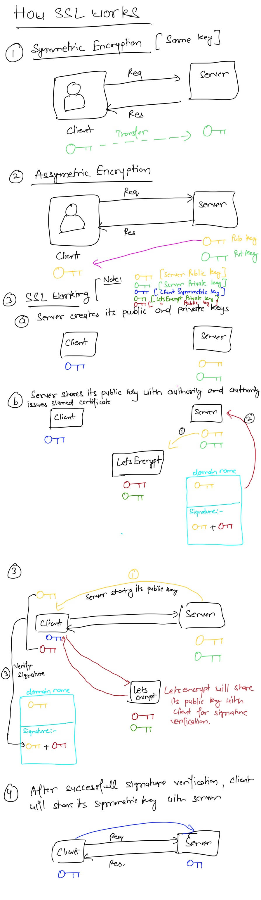

# How SSL works

### Without SSL

1. Suppose we have a user and a server, say Nginx server. Lets assume we dont have any security implemented, then user can single make api request to the server and the server will return the response back to the user.
2. As we dont have any security implemented, any body, say hacker, can see our request and response and can try to modify it. This is called MMA (Man in Middle Attack)
3. To avoid anyone to see our request and response, we need to encrypt the request and the response.

### Types of encryption

1. Symmetric Encryption
   1. Here, we have single key which can be used to encrypt or decrypt data.
   2. Suppose user generates an encryption key and encrypts the request data on his side and sends the encrypted request to server.
   3. The server will not be able to decrypt the data until the same key is shared with it.
   4. If the user send the key to the server, the hacker can also keep a copy of the key with himself and use it to decrypt further requests
   5. Somehow, if server and the client both have the same key then requests can be easily encrypted and decrypted
2. Asymmetric Encryption
   1. We have 2 keys here, one is public key and the other is private key
   2. Public key can be used to encrypt the things and only its private key can decrypt it.

### Using Asymmetric Encryption

1. Our server has the private and public keys available with it.
2. The server will share its public key with the client. The hacker can keep a copy of this key, no issues with it since it is a public key
3. Now, the client/user will generate its symmetric key.
4. The client will encrypt its symmetric key with the public key of the server.
5. Then the encrypted symmentric key will be transfered to the server.
6. Since the key is encrypted by server's public key, the hacker cannot decrypt it since the private key is present with the server only.
7. Now, the server will decrypt the key and hence, the client and the server will now have same symmetric key with them
8. The client can encrypt the data using its symmetric key and the server will decrypt it using the same symmetric key.
9. Thus, we used the asymmetric encryption to share the same symmetric keys with both client and server.
10. Here, the hacker can act as a proxy.
    1. While the server is sharing you its public key, the hacker may take that public key and share a duplicate/fake public key to the user.
    2. The hacker will have the private key, of the duplicate public key, available with him. Because the hacker has generated that duplicate public key.
    3. Now, since user does not know that the public key it received is from the hacker, the user will share its symmetric key using the duplicate public key and the hacker, who has the private key available with him, will be able to decrypt the user's symmetric key and share his symmetric key with the server.
    4. The hacker here will act as a proxy layer. It means any request coming from the user can be decrypted by hacker and hacker can send any data to the server.
    5. Thus, the user needs some way to ensure the public key it received is coming from server only
    6. To solve this, we have role of SSL certificates

### SSL certificates

1. Now the server has a public and private key
2. The server generates an SSL certificate to verify itself.
3. These SSL certificates are signed/generated by some 3rd party authority eg LetsEncrypt. The server will request for SSL certificate from these authorities
4. The authority, say lets encrypt, will ask for server's public key for generating the SSL certificate.
5. The authority, lets encrypt, will also has its own public and private key
6. The authority will create a certificate. The certificate will have the domain of the website, the server's public key and a signature.
7. The signature will have the following formula:
   1. `Signature = Server's Public Key + LetsEncrypt's public key`
8. The certificate will be sent back to the server.
9. Now, whenever the client establishes a connection with server, the server will send its public key along with the SSL certificate to the client.
10. The client will veritfy the public key received with the SSL certificate using the following steps:
    1. The client's browser checks the issuer of the certificate. Lets say, its LetsEncrypt
    2. The browser will request for LetsEncrypt's public key from it.
    3. Now, the client have the public keys of both server and LetsEncrypt
    4. It will try to make the signature using the formula `Signature = Server's Public Key + LetsEncrypt's public key` and then verify it from the certificate.
    5. If there is any mismatch, the signatures will not match.
    6. If the signatures are matched, it means the server's public that the client has received is original.
11. After the verification, the client will encypt its symmetric key using the server's key and send it to the server so both the client and the server has the same symmentric keys

